<p align="center">
  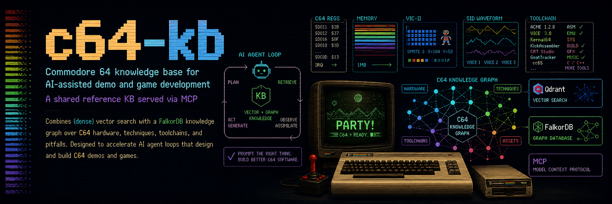
</p>

# c64-kb

A reference for the stock Commodore 64, served to coding agents over MCP
and a CLI: hardware, techniques, pitfalls, recipes and toolchains, as
markdown pages indexed for search and as a graph.

How the pages are checked:

- Every code listing is built with the toolchain it names (Oscar64,
  KickAssembler or cc65) before it lands: `npm run check:listings`.
- Every recipe is run headless in VICE at a pinned cycle count, on each
  model its entry in `docs/recipes/runs.json` names, and its screenshot is
  compared pixel for pixel: `npm run verify:recipes`.
- A number states its evidence: measured here (VICE, an assembler, the ROM
  bytes), two independent pages agreeing, arithmetic from stated
  constants, or unverified.
- A correction says what the old text claimed.

"Verified" means VICE x64sc 3.10 with the real ROM images, not a C64 on a
bench. PAL runs use VICE's default C64C (VIC-II 8565, SID 8580, CIA 8521);
`-model c64` is the older 6569 machine. Measurements on real hardware are
tracked in [#9](https://github.com/bdgscotland/c64-kb/issues/9).

## Starters

Each starter in `templates/` is a small playable game or demo with a
title, a game loop, sound and a self-check. Each picture is the PAL
screenshot its checks grade, with the verdict and the frame meter on
screen.

<table>
<tr>
<td align="center"><a href="templates/shmup-vertical/README.md">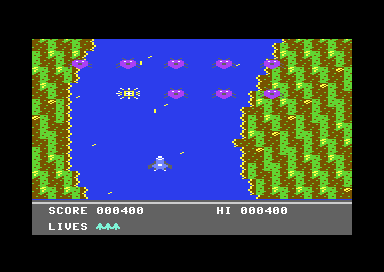</a><br><sub>Vertical shooter</sub></td>
<td align="center"><a href="templates/platformer/README.md">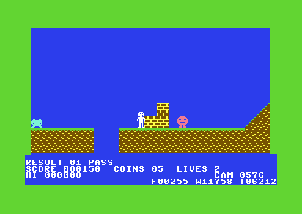</a><br><sub>Scrolling platformer</sub></td>
<td align="center"><a href="templates/action-puzzle/README.md">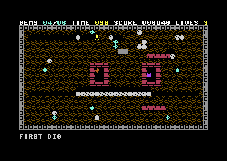</a><br><sub>Boulder Dash-style cave</sub></td>
<td align="center"><a href="templates/adventure/README.md">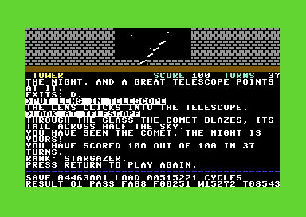</a><br><sub>Text adventure</sub></td>
</tr>
<tr>
<td align="center"><a href="templates/demo/README.md">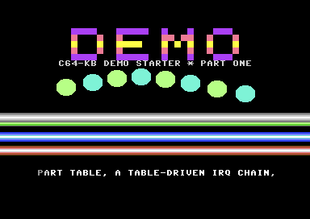</a><br><sub>Demo (KickAssembler)</sub></td>
<td align="center"><a href="templates/beat-em-up/README.md">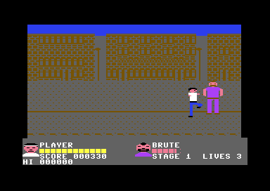</a><br><sub>Beat-em-up</sub></td>
</tr>
</table>

Make a project from one with `npm run new-project -- <starter> <dir>` (see
[Start a game](#start-a-game)).

## Recipes

Each picture is a recipe's committed screenshot, taken from the listing
on its page at a pinned cycle count. A run that differs by one pixel
fails the gate.

<table>
<tr>
<td align="center"><a href="docs/recipes/kickassembler/cracktro-template.md">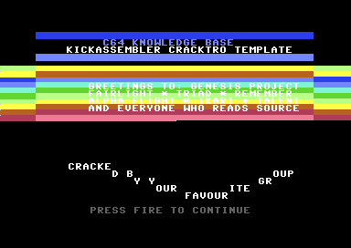</a><br><sub>Cracktro template</sub></td>
<td align="center"><a href="docs/recipes/kickassembler/sideborder-open.md">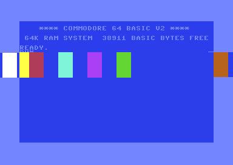</a><br><sub>Side border open</sub></td>
<td align="center"><a href="docs/recipes/kickassembler/sprite-multiplex-24.md">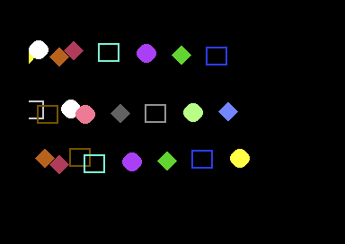</a><br><sub>24-sprite multiplexer</sub></td>
<td align="center"><a href="docs/recipes/kickassembler/fli-image.md">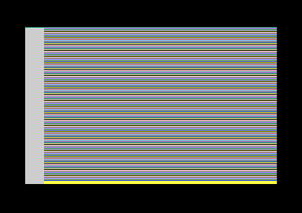</a><br><sub>FLI</sub></td>
</tr>
<tr>
<td align="center"><a href="docs/recipes/oscar64/tile-map-render.md">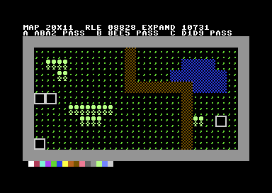</a><br><sub>Tile map from RLE</sub></td>
<td align="center"><a href="docs/recipes/oscar64/text-overlay-playfield.md">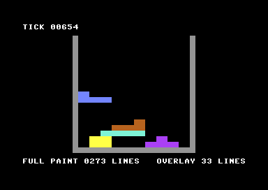</a><br><sub>Text-mode playfield</sub></td>
<td align="center"><a href="docs/recipes/oscar64/simple-shmup.md">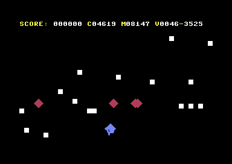</a><br><sub>Simple shmup</sub></td>
<td align="center"><a href="docs/recipes/kickassembler/colour-fade.md">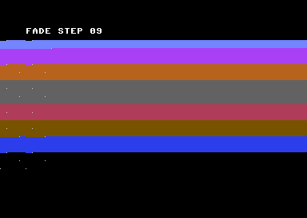</a><br><sub>Luminance fade, step 9</sub></td>
</tr>
<tr>
<td align="center"><a href="docs/recipes/kickassembler/wireframe-ships.md">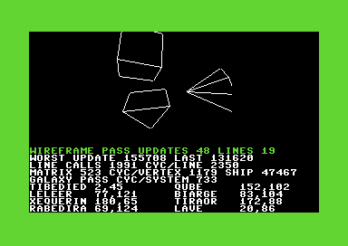</a><br><sub>Wireframe ships and a seeded galaxy</sub></td>
<td align="center"><a href="docs/recipes/oscar64/ghost-targeting.md">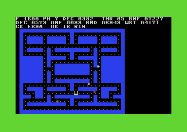</a><br><sub>Maze-chase ghost targeting</sub></td>
<td align="center"><a href="docs/recipes/oscar64/cave-scan.md">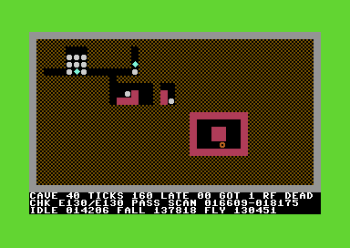</a><br><sub>Cave scan: falling and rolling</sub></td>
<td align="center"><a href="docs/recipes/oscar64/platformer-scaffold.md">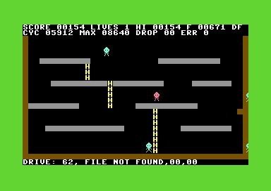</a><br><sub>Platformer scaffold</sub></td>
</tr>
<tr>
<td align="center"><a href="docs/recipes/kickassembler/scroll-panel-split.md">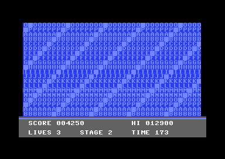</a><br><sub>Scroll with a fixed panel</sub></td>
<td align="center"><a href="docs/recipes/kickassembler/sprite-multiplex-game.md">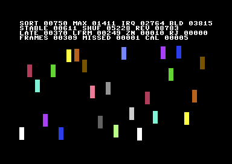</a><br><sub>Game multiplexer, 24 actors</sub></td>
<td align="center"><a href="docs/recipes/kickassembler/big-font-scroller.md">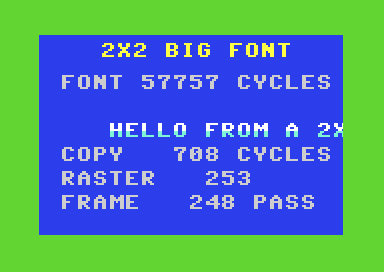</a><br><sub>2x2 big font</sub></td>
<td align="center"><a href="docs/recipes/kickassembler/dycp-scroller.md">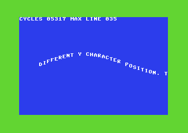</a><br><sub>DYCP scroller</sub></td>
</tr>
<tr>
<td align="center"><a href="docs/recipes/kickassembler/isometric-room.md">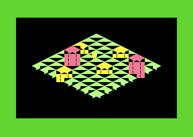</a><br><sub>Isometric room</sub></td>
<td align="center"><a href="docs/recipes/kickassembler/fire-effect.md">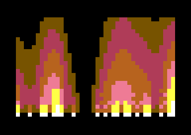</a><br><sub>Colour-RAM fire</sub></td>
<td align="center"><a href="docs/recipes/kickassembler/dot-flag.md">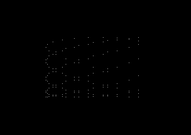</a><br><sub>Dot flag</sub></td>
<td align="center"><a href="docs/recipes/kickassembler/dypp-sprite-scroller.md">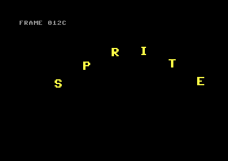</a><br><sub>DYPP sprite scroller</sub></td>
</tr>
<tr>
<td align="center"><a href="docs/recipes/kickassembler/mci-interlace.md">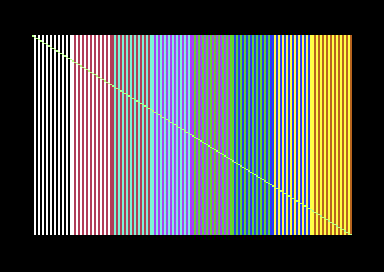</a><br><sub>Multicolour interlace, one field</sub></td>
<td align="center"><a href="docs/recipes/kickassembler/sprite-priority-classes.md">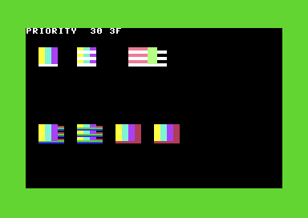</a><br><sub>Sprite priority classes</sub></td>
<td align="center"><a href="docs/recipes/oscar64/beat-em-up-lanes.md">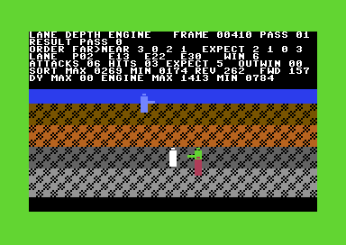</a><br><sub>Beat-em-up lanes</sub></td>
<td align="center"><a href="docs/recipes/oscar64/bitmap-koala-viewer.md">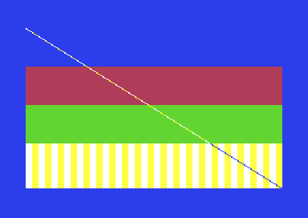</a><br><sub>Koala viewer</sub></td>
</tr>
<tr>
<td align="center"><a href="docs/recipes/oscar64/vehicle-control.md">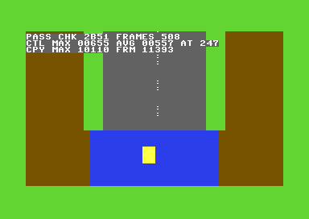</a><br><sub>Vehicle control</sub></td>
<td align="center"><a href="docs/recipes/oscar64/car-contact.md">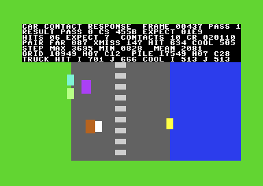</a><br><sub>Car contact and push</sub></td>
<td align="center"><a href="docs/recipes/kickassembler/twister.md">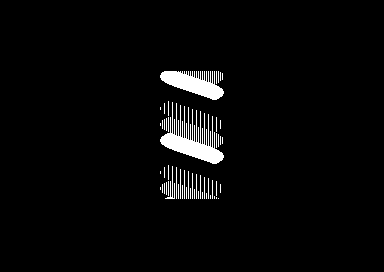</a><br><sub>Twister</sub></td>
<td align="center"><a href="docs/recipes/kickassembler/tech-tech.md">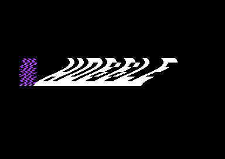</a><br><sub>Tech-tech</sub></td>
</tr>
<tr>
<td align="center"><a href="docs/recipes/oscar64/destructible-terrain.md">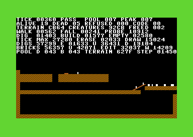</a><br><sub>Destructible terrain</sub></td>
<td align="center"><a href="docs/recipes/oscar64/adventure-engine.md">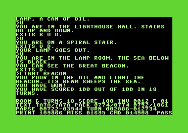</a><br><sub>Adventure engine</sub></td>
<td align="center"><a href="docs/recipes/oscar64/falling-blocks.md">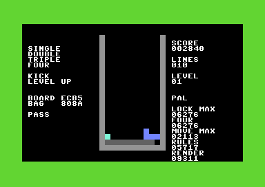</a><br><sub>Falling blocks</sub></td>
<td align="center"><a href="docs/recipes/kickassembler/sprite-border-scroller.md">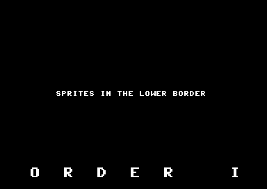</a><br><sub>Scroller in the border</sub></td>
</tr>
</table>

## Quick start

You need Node.js 24.12 or later, Docker, and [Ollama](https://ollama.com/)
with `mxbai-embed-large` pulled. Ollama is needed to ingest the docs.
After that, queries work without it: search falls back to keywords, and
the graph tools do not use it.

### From npm

```bash
npm install -g c64-kb
ollama pull mxbai-embed-large

c64-kb services up        # Qdrant (port 7333) and FalkorDB (7379) in Docker
c64-kb ingest             # builds both stores from the docs in the package; a few minutes
c64-kb health             # checks the services and prints what the stores hold

claude mcp add c64-kb -- c64-kb serve    # connect Claude Code
```

State goes to `$XDG_DATA_HOME/c64-kb`, else `~/.local/share/c64-kb`. That
covers the analytics database, the BM25 vocabulary, ingest hashes and the
containers' volumes. Set `C64_KB_DATA_DIR` to move it. After upgrading,
run `c64-kb ingest --clean` so the stores match the new docs.
`c64-kb services down` stops the containers and keeps their data.

### From a clone

A clone is needed for the starters, `new-project` and the gates, because
`scripts/` is not in the npm package. The starters and gates also need
Oscar64, Java with KickAssembler 5.25, VICE (`x64sc` and `c1541`), `make`,
and Python 3 with Pillow. Missing toolchains are reported, not skipped
silently.

```bash
docker compose up -d      # Qdrant and FalkorDB; volumes in ./storage
npm install
npm run build
npm run ingest            # first time; later runs skip unchanged files
npm run health
```

In a clone, state lives in `./data`. The repo's `.mcp.json` runs
`node dist/cli.js serve`, so Claude Code opened in the repo connects on
its own once `dist/` is built.

### Example

```console
$ c64-kb check-compatibility fli_image sprite_multiplex_24
# Compatibility: fli_image + sprite_multiplex_24

**Verdict:** INCOMPATIBLE — not as combined; each hard conflict below says how to separate them.
...
## unit_contention (hard): fli_image × sprite_multiplex_24
**Shared:** vic_raster_irq
Both fli_image and sprite_multiplex_24 own vic_raster_irq: each writes or holds it every frame and expects no one else to.
**Resolution:** There is one raster compare. Run both as handlers in one interrupt chain (irq_chain_table): ...
...
```

`VERSION` carries the data, schema and tool-surface versions, and
[CHANGELOG.md](CHANGELOG.md) says what each change fixed and why.

Other examples: `c64-kb technique-lookup sideborder_open`,
`c64-kb pitfalls-for stable_raster_irq`, `c64-kb plan-budget
scroll_panel_split sprite_multiplex_game`, `c64-kb game-briefing
"vertical shooter"`. `c64-kb --help` lists every command, and `--json`
gives the structured form.

### Connect another project

From an npm install, add this to the project's `.mcp.json`:

```json
{
  "mcpServers": {
    "c64-kb": { "type": "stdio", "command": "c64-kb", "args": ["serve"] }
  }
}
```

From a clone, use `"command": "node"` and
`"args": ["/absolute/path/to/c64-kb/dist/cli.js", "serve"]`.

## Start a game

In a clone:

```bash
npm run new-project -- shmup-vertical ~/Developer/c64/mygame
```

This copies the starter and the shared harness (`templates/_harness/`)
into the new directory. It writes `.mcp.json` and `local.mk` pointing at
this checkout, then runs the starter's headless check to prove the copy
works. `npm run new-project -- --list` names the starters: `shmup-vertical`,
`platformer`, `action-puzzle`, `adventure`, `beat-em-up`, `demo`, and two
minimal templates that show the harness rather than a game: `hello`
(Oscar64 calling KickAssembler) and `hello-kick` (KickAssembler only).

In the new project:

| Target | What it does |
|---|---|
| `make` | Builds, once `PLAN.md` holds the KB's compatibility and budget output for your technique list (the plan gate) |
| `make run` | Opens the game in VICE |
| `make shot check` | Runs the autopilot build (a scripted player drives the game) headless on PAL and NTSC and grades the screenshots |
| `make selftest` | Proves the check fails on a deliberately broken build |
| `make disk` | Builds a `.d64` |
| `make claims` | Traces every store the program makes in VICE and fails on one to hardware it did not declare |
| `make zp` | Lists the zero page the compiled C touches |
| `make released OSCAR64_RELEASED=<path>` | Builds and grades the game with another Oscar64, such as a release |

A frame meter prints each run's worst and median frame in cycles. Several
starters add their own proofs, such as a tear check, a disk save-and-reload
test or a lost-frame soak. [docs/workflow/agent-harness.md](docs/workflow/agent-harness.md)
explains the loop.

The starters build with the Oscar64 described under [Toolchains](#toolchains).
`shmup-vertical`, `platformer`, `action-puzzle` and `beat-em-up` are also
recorded passing on the released v1.32.273 (`make released`).

## Tools

The MCP server and the CLI call the same functions.

**Look something up**

| Tool | Answers |
|---|---|
| `c64_search` | Hybrid semantic and keyword search across every page |
| `c64_lookup_register` | A register by name (`D011`), mnemonic or address: chip, read/write, aliases |
| `c64_lookup_kernal` | A KERNAL routine by name or jump-table address, with its paired routines |
| `c64_memory_map` | The region(s) holding an address, read as hex (`$0400` or `0400`), banked overlaps included |
| `c64_lookup_opcode` | A 6510 opcode by byte or mnemonic, legal and illegal |
| `c64_pal_ntsc_diff` | PAL and NTSC differences for a topic |

**Plan a program**

| Tool | Answers |
|---|---|
| `c64_game_briefing` | A game plan from a brief. It routes the brief to an archetype by its words (or takes one), proposes techniques, pitfalls, a toolchain split and a build order, and names the starter to begin from |
| `c64_demo_briefing` | The same for a demo, with an optional demo archetype (cracktro, demo intro, pack intro, dentro, 4K party intro) |
| `c64_check_compatibility` | Whether techniques can share a program. Hard conflicts include CPU every line, an interrupt needing cycles the CPU never gives up, a constant sprite set, KERNAL banked out, the serial bus busy, a region mismatch, the same hardware unit owned twice and zero page used twice. Softer notes include shared registers and KERNAL routines, a unit shared or read while another drives it, init order, and KERNAL zero page clobbered. Raster bands that do not overlap clear the line-sharing rules. It follows each technique's prerequisites, and says what the graph does not know |
| `c64_timing_budget` | Cycles per raster line for one technique on PAL or NTSC: badline, IRQ entry and sprite DMA losses |
| `c64_plan_budget` | A technique list, per phase (play, transition, init), against a frame: a cycle range from measured figures, what was left out and why, what has no figure yet, and a verdict. Given a game design, it sets that game's measured frame beside the prediction |

**Build it**

| Tool | Answers |
|---|---|
| `c64_technique_lookup` | A technique: the registers and KERNAL routines it uses, what it requires and what requires it, the recipes that implement it, the pitfalls it avoids |
| `c64_techniques_for` | Techniques filtered by category, chip, region, register, recipe, prerequisite or the hardware unit they claim |
| `c64_recipe_lookup` | One recipe: metadata, the page, the machines it was verified on |
| `c64_recipes_for` | Recipes filtered by toolchain, region, technique, file format or verified machine |
| `c64_toolchain_hint` | An idiomatic snippet for a toolchain and intent; Oscar64 by default |

**Avoid mistakes**

| Tool | Answers |
|---|---|
| `c64_pitfalls_for` | Pitfalls a register, KERNAL routine or technique triggers, and those a technique avoids |
| `c64_lint_source` | Pitfall rules run over your C or assembly source |
| `c64_failure_diagnose` | Crash patterns that match a symptom, ranked by keyword overlap |

`c64_lint_source` (CLI: `c64-kb lint game.c`) compiles the pitfall pages
into text rules. It checks for:
- a read or read-modify-write of a SID register;
- `$DC02` cleared and never restored;
- an empty-name OPEN of channel 15 followed by a read;
- a `$D012` busy-wait in a file that never installs an interrupt;
- a zero LFSR seed;
- an interrupt handler reaching `ADC` or `SBC` before `CLD`;
- an unmasked store to `$D016`;
- `JMP ($xxFF)`.

Each finding is `definite`, `likely` or `heuristic`. It lints one file at
a time, so silence is not a pass. The rules are in `src/tools/lint/`, and
the CLI exits 1 on a definite finding.

**Maintain and run**

| Tool | Answers |
|---|---|
| `c64_health` | Service health and the live figures |
| `c64_ingest_doc` | Writes a page under `docs/` and ingests it at once |
| `c64_coverage`, `c64_suggest_links`, `c64_report_gap` | Coverage per category, suggested missing edges, and a record of a query that found nothing |
| `c64_run_game` | Runs an Oscar64 build (it needs the `.dbj` debug file) in VICE through [vice-mcp](https://github.com/simen/vice-mcp), drives it, and returns a state trace and the screen. It needs vice-mcp built (`VICE_MCP_PATH`) and `x64sc`; the repo's windowless VICE is used when present |
| `c64_re_irq_chain` | Runs a `.prg` headless in `x64sc` and reports its interrupt chain: every vector write, every raster line armed, and every handler entry with its line, cycle and frame. The PRG must be inside the repo or the temp directory |
| `c64_re_frame_profile` | Runs a `.prg` headless in `x64sc` and times every occurrence of a region between a start and stop marker, in CPU cycles: worst, typical (median), count, unpaired starts and samples over one frame. The PRG must be inside the repo or the temp directory |

The CLI has a command for every tool except the `c64_coverage` row and
`c64_run_game`. It also has `services`, `ingest`, `serve` and `version`.

**Resources** are whole reference documents at `c64://memory-map`,
`c64://kernal-jumptable`, `c64://opcodes`, `c64://illegal-opcodes`,
`c64://pal-ntsc`, `c64://vic-ii`, `c64://sid`, `c64://cia`,
`c64://6510-cpu`, `c64://registers` and `c64://ontology`. There is also
`c64://register/{name}` for one register. **Prompts:** `c64_demo_brief`
and `c64_game_brief`.

### The graph

The same pages feed a graph in FalkorDB. It answers:

- Which registers and KERNAL routines a technique touches, and which
  recipes implement it.
- What a technique needs underneath it, and what builds on it.
- Which pitfalls it triggers and which it avoids.
- Whether two techniques can share a frame: resource demands, hardware
  units claimed (sprites, SID voices, CIA timers, the raster compare,
  vectors, zero page) and raster bands.
- Which zero-page bytes a KERNAL call may and must clobber. That comes
  from a walk of the ROM and from VICE traces.
- What a technique costs per frame, measured on a named recipe, and
  whether a set fits.
- What shape a game is (its archetype) and which starter plays it.
- What a whole game measured, per phase.
- Which recipes were verified on which machine models.

[docs/ONTOLOGY.md](docs/ONTOLOGY.md) lists every node and edge, and the
page line that produces each.

## docs/

| Directory | What you find |
|---|---|
| [hardware/](docs/hardware) | VIC-II, SID, CIA, the 6510 with legal and illegal opcodes, the KERNAL jump table, the memory map, a register table, PAL vs NTSC |
| [techniques/](docs/techniques) | One section per technique across raster, sprite, scroll, bitmap, banking, SID, CPU tricks, loaders, 3D, transitions, text, input, game logic, maths and file I/O. Each technique carries the metadata the compatibility and budget tools read |
| [pitfalls/](docs/pitfalls) | Gotchas by area, each with a severity, what triggers it and the fix. [c64-failure-patterns.md](docs/c64-failure-patterns.md) maps symptoms to causes |
| [recipes/](docs/recipes) | Complete programs in Oscar64, KickAssembler and cc65, each with its build command, expected output, a committed VICE screenshot and the reasoning |
| [toolchains/](docs/toolchains) | Oscar64, KickAssembler and cc65 references with their error messages, and build and release tools (cartconv, cc1541, petcat, png2prg, sidreloc, Spindle), memory layout and release disks |
| [runtime/](docs/runtime) | VICE, including how to read an exit screenshot, plus vice-mcp and sim6502 |
| [formats/](docs/formats) | PRG, D64, T64, CRT, SID and more, and the IEC bus and 1541 |
| [game-design/](docs/game-design) | Game archetypes, whole-game designs with measured frames, design patterns, game structure, enemy behaviour, production planning, and the licence table for reference game sources |
| [demo-design/](docs/demo-design) | Demo archetypes and composition |
| [art/](docs/art), [music/](docs/music) | Asset pipelines and music production |
| [workflow/](docs/workflow) | The agent harness the starters share |

## Scope

The stock Commodore 64, PAL and NTSC, and the common peripherals the pages
cover: the 1541 drive, the 17xx REU, cartridges (including EasyFlash), the
1351 mouse, paddles and the light pen. Out of scope: the C128, Mega65,
SuperCPU and Ultimate II+.

## Toolchains

- **Oscar64** is the default; `c64_toolchain_hint` answers with it unless
  asked for another.
- **KickAssembler** is for work where C costs too many cycles: stable
  raster interrupts, border opening, FLI, multiplexers. KickAssembler
  5.25 is the version verified here.
- **cc65** has light coverage, mostly text-mode utilities.

The Oscar64 recipes were verified with a locally patched build: upstream 709bd70 plus one unpublished fix. Released
Oscar64 fails many of them ([#25](https://github.com/bdgscotland/c64-kb/issues/25)),
so CI skips the Oscar64 recipes for now. Miscompiles found along the way
are reported with repros in [#30](https://github.com/bdgscotland/c64-kb/issues/30),
and `CLAUDE.md` lists the ones that cost time. Whether Oscar64's GPL-3.0
reaches programs built with its runtime is an open question
([#31](https://github.com/bdgscotland/c64-kb/issues/31)).

## Configuration

| Service | Host port |
|---|---|
| Qdrant (REST, gRPC) | 7333, 7334 |
| FalkorDB | 7379 |
| Ollama | 11434 |

The Qdrant and FalkorDB ports are shifted from their defaults (6333, 6334,
6379), so another instance of either can run alongside.

| Variable | Sets |
|---|---|
| `C64_KB_DATA_DIR` | Where state lives (npm install) |
| `C64_KB_STORAGE` | Where the containers' volumes live |
| `QDRANT_URL`, `QDRANT_COLLECTION` | The vector store and collection (`c64_docs`) |
| `FALKOR_HOST`, `FALKOR_PORT`, `FALKOR_GRAPH` | The graph store and graph name (`c64`) |
| `OLLAMA_URL`, `EMBED_MODEL`, `EMBED_CONCURRENCY` | Embeddings (`mxbai-embed-large`; another model must also give 1024 dimensions) |
| `DOCS_DIR`, `ANALYTICS_DB` | The docs to ingest and the analytics database |
| `KICKASS_JAR`, `OSCAR64`, `CL65` | Toolchains for the listing gate (the starters read the first two) |
| `X64SC_BIN`, `VICE_MCP_PATH` | The VICE binary, and vice-mcp for `c64_run_game` |

## Architecture

The pages in `docs/` are the source of truth. Ingest reads each page once
and writes it two ways:
- Qdrant stores its chunks with dense and BM25 vectors for search.
- FalkorDB stores the things the page defines, and their relations, as a
  graph. `docs/CONVENTIONS-*.md` define the structure the extractor reads.

Ingest runs in two passes: nodes first, then edges. A reference to a node
that does not exist is reported, never dropped silently. A SQLite database
records the query tools' calls, so queries that find nothing surface as
gaps. The MCP server and the CLI share one set of tool functions. See
[docs/ARCHITECTURE.md](docs/ARCHITECTURE.md).

## Development

| Command | What it does |
|---|---|
| `npm run build` | Compile to `dist/` |
| `npm run dev`, `npm run dev:serve` | Run the CLI or the MCP server from source |
| `npm run services`, `npm run services:stop` | Start or stop Qdrant and FalkorDB |
| `npm run ingest` | Ingest changed pages |
| `npm run ingest:clean` | Wipe and re-ingest everything. Needed after any metadata change, because the graph never removes an edge a page stopped asserting |
| `npm test` | Unit and integration tests, against throwaway stores (`c64_test`, `c64_docs_test`); `test:unit` alone needs no services |
| `npm run typecheck`, `npm run lint`, `npm run format:check`, `npm run knip` | Type-check, ESLint with a complexity budget, Prettier, unused code |
| `npm run check:listings` | Build every listing with its toolchain |
| `npm run verify:recipes` | Run every recipe in VICE and compare with its screenshot; `--update` re-baselines after a deliberate change |
| `npm run verify:templates` | Make a project from every starter and run its checks; `--selftest` adds the broken-build test and each starter's own proofs |
| `npm run vice:headless` | Build a windowless VICE into `.tools/`, which every emulator run then prefers |
| `npm run new-project` | Start a project from a starter |

CI runs the type check, lint, formatting, unused-code check and unit tests.
It also runs integration tests against service containers, the listing and
recipe gates for KickAssembler and cc65, and an install-and-ingest test of
the packed package. It skips the Oscar64 listings and recipes until #25,
and does not run the starters or a full ingest. `npx lefthook install`
adds git hooks that run the fast gates on what you stage. Releases publish to npm from a
version tag; [CLAUDE.md](CLAUDE.md) gives the steps.

### Contributing

Add a page to `docs/` in the structure its `docs/CONVENTIONS-*.md` file
defines, then run `npm run ingest` (or `ingest:clean` after changing a
metadata line). Ingest warns about every reference to a node the graph
does not have: fix the page. A listing that does not build does not land.
A recipe's picture must match its screenshot, and a deliberate change is
re-baselined and explained on the page.

[CLAUDE.md](CLAUDE.md) holds the rules, the instruments and the gates.
It is written for Claude Code, and the repo's `.claude/` hooks enforce the
rules as you edit:
- a doc edit builds its listings, and re-runs a recipe in VICE when
  `x64sc` is found;
- a TypeScript edit is formatted, linted and type-checked;
- `git add -A` and `--no-verify` are refused.

The repo's Claude Code skills cover verifying a listing, auditing a page,
and adding a page the graph can read. [CONTRIBUTING.md](CONTRIBUTING.md) covers setup and
code conventions. [SECURITY.md](SECURITY.md) says how to report a
vulnerability; a wrong fact is an ordinary issue.

## Related tools

[vice-mcp](https://github.com/simen/vice-mcp) drives VICE over MCP;
`c64_run_game` needs it. [sim6502](https://github.com/barryw/sim6502)
unit-tests 6502 code without an emulator. Nothing else here needs either.

## License

BSD-3-Clause: the code, the documents and the listings. Third-party
sources are cited; which may be adapted and which are used for facts only
is recorded in
[docs/game-design/reference-game-sources.md](docs/game-design/reference-game-sources.md).
The package documents GPL tools (Oscar64, VICE) but ships none of their
code.
