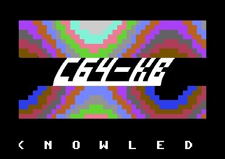
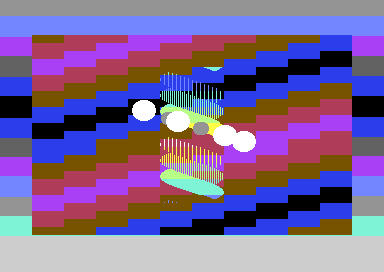
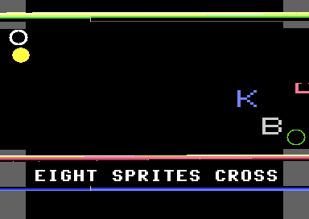
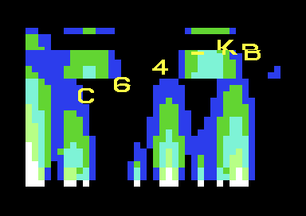
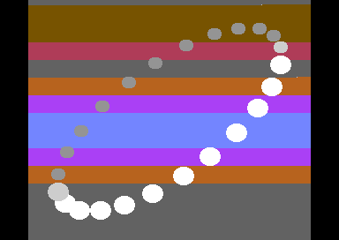

# C64-KB: a five-part C64 demo built from the knowledge base

C64-KB is a demo for the stock Commodore 64, written in KickAssembler from
this knowledge base's techniques and recipes and nothing else. It was built
under the working title MEASURED and took the knowledge base's name on
2026-09-24. It has six screens: five parts and an end screen on which each
part prints what it measured of itself. Every effect is a KB technique with
a recipe behind it, one tune plays through it (two more are written and held back), and the whole thing runs
headless under the KB's harness with a verdict byte, a frame meter and
pinned screenshots on PAL and NTSC. A loader-based version, with the tune
data and a resident loader under the KERNAL, is in progress and is not in
this tree.

`DESIGN.md` is the design it was built to: the part list, the contract every
part keeps, the memory map and the sync plan, with the amendments the build
forced dated in place.

| Part 1 LOGO | Part 2 TWIST | Part 3 BORDER | Part 4 FIRE | Part 5 SPRITES |
| ----------- | ------------ | ------------- | ----------- | -------------- |
|  |  |  |  |  |

The pictures are the PAL shots `verify.sh` takes inside each part's dwell.
The end screen is `screenshots/end-pal.png` and `screenshots/end-ntsc.png`.

## The running order

The figures are each part's own CIA1 timer A bracket of its per-frame work,
interrupt work summed with frame work, worst frame and typical frame, as
printed on the end screen of the AUTOPILOT build (`screenshots/end-pal.png`
and `end-ntsc.png`, five digits each). The `+` after each row on that screen
is the part's own selfcheck passing.

| #   | Part    | KB techniques                                                                                  | Recipes                                                                                                                                                                                                                                              | PAL worst | PAL typical | NTSC worst | NTSC typical |
| --- | ------- | ---------------------------------------------------------------------------------------------- | ---------------------------------------------------------------------------------------------------------------------------------------------------------------------------------------------------------------------------------------------------- | --------: | ----------: | ---------: | -----------: |
| 1   | LOGO    | tech_tech_wobbler, plasma, sprite_border_scroller, topbottom_border_open                        | [tech-tech](../../docs/recipes/kickassembler/tech-tech.md), [plasma](../../docs/recipes/kickassembler/plasma.md), [sprite-border-scroller](../../docs/recipes/kickassembler/sprite-border-scroller.md)                                              |    11,195 |      10,453 |     11,770 |       11,018 |
| 2   | TWIST   | twister, vector_balls_sprites                                                                  | [twister](../../docs/recipes/kickassembler/twister.md), [vector-balls](../../docs/recipes/kickassembler/vector-balls.md)                                                                                                                             |    13,914 |      13,273 |     14,803 |       13,054 |
| 3   | BORDER  | dysp_side_border_sprites, big_font_2x2, soft_scroll_h, raster_bars, topbottom_border_open      | [dysp](../../docs/recipes/kickassembler/dysp.md), [soft-scroll-h](../../docs/recipes/oscar64/soft-scroll-h.md) (ported from Oscar64)                                                                                                                 |    27,538 |      13,148 |     31,028 |       13,924 |
| 4   | FIRE    | fire_effect, sprite_sine_chain (on a Lissajous path), colour_cycling (a palette wave), luminance_dissolve | [fire-effect](../../docs/recipes/kickassembler/fire-effect.md), [luminance-dissolve](../../docs/recipes/kickassembler/luminance-dissolve.md)                                                                                                    |    31,926 |      31,540 |     32,810 |       30,117 |
| 5   | SPRITES | sprites_only_screen_mode, sprite_multiplex_24, vector_balls_sprites, raster_bars               | [sprites-only-screen](../../docs/recipes/kickassembler/sprites-only-screen.md), [sprite-multiplex-24](../../docs/recipes/kickassembler/sprite-multiplex-24.md), [vector-balls](../../docs/recipes/kickassembler/vector-balls.md)                    |     7,933 |       6,442 |      9,149 |        7,147 |

Parts 1, 2, 3 and 5 leave through `colour_fade`
([colour-fade](../../docs/recipes/kickassembler/colour-fade.md)), a
luminance fade of the border, the background and the colour RAM; part 4
leaves through its own luminance dissolve. Part 3 runs eight DYSP sprites
across both open side borders on PAL and five on NTSC. Part 5's twenty-four
balls sit on eight hardware sprites through fixed multiplexer rows twenty
lines apart. The end screen's `LATE FRAMES` line counts line-255 interrupts
that arrived while a part's frame work was still running, 415 on PAL and
1,106 on NTSC, most of them the fire's half passes, which take more than a
frame by design; the sequencer runs the work once more as soon as it
returns. The screen's last figure row is the KB's own compatibility census
over the demo's technique list: 16 techniques, 48 hard conflicts among them,
five parts that keep them apart.

The end screen also carries the harness meter, which brackets part 5's frame
work for its first 200 frames, separately from the parts' own brackets:

| Model | Frames | Worst | Typical |
| ----- | -----: | ----: | ------: |
| PAL   |    200 | 3,134 |   3,129 |
| NTSC  |    200 | 6,648 |   6,525 |

## The music

Three tunes were written, all original, each to a stated grammar and passed
through the gates in `music/tunecheck.py` before anyone listened. Only tune A
plays: the maintainer approved it by ear and did not approve the other two,
so the sequencer's switches to them are held back and they sit in the data
image unused.

| Tune                | Where           | Key, tempo, length                          |
| ------------------- | --------------- | ------------------------------------------- |
| A, "Lists (darker)" | every part and the end screen | C minor, 150 BPM, 60 bars, loops to bar 4 |
| B, "Stabs"          | not played (held back) | G minor, 166.7 BPM, 26 bars, loops to bar 2 |
| C, "After"          | not played (held back) | C minor, 125 BPM, 16 bars, a coda |

The player is the KB's own three-voice player (`sid_play_routine_pattern`,
descended from the [sfx-in-player](../../docs/recipes/kickassembler/sfx-in-player.md)
recipe) with wavetables, pulse and filter programs, hard restart, and an
NTSC skip of one call in six, so a tune keeps its PAL tempo and the parts
change at the same second on both models. A part ends when `music_pos`, the
bar voice 1 is on, reaches the sequencer's value for it: bars 12, 24, 36,
46 and 56 of tune A. Tune A's break (and tune B's drop, unheard in the demo)
uses `sid_env3_filter_envelope`
([sid-env3-filter](../../docs/recipes/kickassembler/sid-env3-filter.md)):
voice 3 is gated with each bass note and held out of the mix, and its
envelope, read back from `$D41C`, drives the filter cutoff.

The data of all three tunes is one pooled image of 2,133 bytes, assembled
to load at `$6000` and run at `$E000`: the sequencer copies it under the
KERNAL ROM once at start and banks the KERNAL out around every `music_play`
call. `music/README.md` explains the compiler, the cap the loader-based
version imposes and how to regenerate the data; run on this tree, the
compiler's output is the shipped `src/parts/music3_data.asm` byte for byte.
`music/tune_B3.py`, a half-time variant of tune B, is kept beside it; like
B and C it is not in the demo until the maintainer approves a render.

## Build and verify

You need KickAssembler (Java), VICE 3.10's `x64sc`, `c1541`, Python 3 and
make. The headless runs want a windowless `x64sc` so that no window opens
and steals focus; the KB builds one with `npm run vice:headless`. Tool paths
come from the environment or from a `local.mk` beside the Makefile
(`KICKASS_JAR`, `X64SC`, `X64SC_WINDOWED`, `C1541`), and without either the
harness falls back to its own defaults and then to `x64sc` on the path.

```
make tools          # print the tools the harness resolved
make                # release build: build/c64-kb.prg
make shot check     # AUTOPILOT build, end-screen shots on PAL and NTSC, graded against expect.json
make selftest       # the FORCE_FAULT build must fail the same checks
make disk           # build/c64-kb.d64
bash verify.sh      # all of the above, then a shot inside each part on both models, graded
```

Or run the release build in any VICE: `x64sc build/c64-kb.prg`.

The harness's plan gate, which checks that a `PLAN.md` holds the KB tools'
compatibility verdict for the technique list, is off in this tree
(`PLAN_GATE ?= off` in the Makefile): the audit it reads is working notes
and does not ship. `verify.sh` takes its emulator from `make tools`, so it
runs on a bare checkout with no `local.mk`.

The parts also run on their own. Each `test/pN_test.asm` includes
`test/stub.inc`, a minimal sequencer that runs one module through the
lifecycle, freezes it at frame 300, grades it and writes the verdict byte.
Build one with `java -jar KickAss.jar test/p3_test.asm -odir build -o
build/p3_test.prg`, run it headless with the flags `verify.sh` uses and a
cycle count past the freeze (10,000,000 for part 1, 14,000,000 for the
others), and grade the pair with `python3 harness/check.py
test/expect-p3.json pal.png ntsc.png`. `test/music_b_test.asm` does the same
for the player with the tune chosen on the command line (`:tune=0
:pos300pal=3 :pos300ntsc=3` for tune A; `1`, `4`, `3` for B; `2`, `3`, `2`
for C) and grades itself with a green border. The pins in `test/shots/` are
those pictures.

## How it was verified

VICE x64sc 3.10, windowless and in warp, on its default PAL machine and
`-model ntsc`, run from this tree on 2026-09-24. Each check is counted once
per model.

- **The end screen.** `make shot check` runs the AUTOPILOT build to
  100,000,000 cycles on both models, past part 5's fade, and `expect.json`
  grades the frozen screen: the verdict byte and green border, the title
  and credits, the five part rows, `PARTS 5/5 PASS`, the technique rows,
  the frame meter's 200 frames, and the title area identical on both
  models. 29 of 29 pass.
- **The fault build.** `make selftest` builds with `FORCE_FAULT`, which
  poisons part 2's depth table so that its selfcheck fails and one ball is
  drawn behind another it should cover. The end screen reads
  `PARTS 4/5 FAIL` with a red border and `check.py` rejects it on both
  models, so the checks are known to be able to fail.
- **Frozen at frame 300.** Each part's standalone runner grades a static
  picture against `test/expect-pN.json`: sprite boxes, lit and unlit pixels
  where the recipes' tables predict them, text rows, and the part's own
  selfcheck through the verdict byte. Part 1 passes 19 of 19, part 2 51 of
  51, part 3 24 of 24, part 4 13 of 13 and part 5 27 of 27, on both models.
  The music runner grades green for all three tunes on both models.
- **Inside each part.** `verify.sh` takes a screenshot inside every part's
  dwell on both models, at the cycle counts listed in the script, and grades
  it against `expect-pN-demo.json`. Every part passes every check but the
  verdict line, which fails mid-demo by design and the script discounts:
  part 1 23 of 25, part 2 16 of 18, part 3 14 of 16, part 4 10 of 12 and
  part 5 13 of 15, and the script exits 0. Part 1's checks are facts that
  hold at any frame: the word's 4,992 white pixels, the plasma rows lit
  with ramp colours and never white, the scroller band in the lower border
  and, on NTSC, its wrap into the next frame's first lines. Part 2's pin
  one frame per model, each value derived from the part's own colour and
  phase tables at the roll offset, bar position and twister phase read off
  the shot, and its note says to re-pin when the timeline moves.
- **The harness.** `harness/` is the copy of the KB's `templates/_harness`
  this demo was built and verified with. Its `ink` check, an area with a
  background colour and a minimum count of pixels that are not that
  background, for pictures whose elements move, went from this copy into
  the template. The template has since moved on: refusals printed as
  `FAIL REFUSED` on stdout, `mid_run` files, `dy` offsets for text under a
  scrolled playfield, a refusal of `-model pal` pictures, and the deadline
  and SID watch targets. Replacing this copy with the template was not
  tried, so the tree ships the copy the figures above were taken with.

## What is not established

- **Real hardware.** Every figure and every picture is VICE x64sc 3.10.
  Nobody has watched it on a C64.
- **Sound.** The harness runs with `+sound`. The tunes are graded by their
  position byte, their call count and their gates, and the ENV3 passages
  against a register dump. Nobody but the maintainer has listened to them,
  and nobody has heard them on a 6581 against an 8580 outside the
  emulator's models.
- **Part 5 moves at 25 Hz.** The projection and the sort run on even frames
  and the schedule build on odd ones, to keep each frame under the NTSC
  budget, so the balls step every second frame. Whether that reads as
  smooth is a judgement nobody has made on a real display.
- **The NTSC fallback in part 3.** NTSC runs five DYSP sprites, 24 lines
  apart, where PAL runs eight: with eight on NTSC some sprite sets met
  one-cycle stalls the stall-table rule does not predict, each at one
  alignment only, so no table entry could meet them (the note above
  `Y_SPACING` in `src/parts/p3_border.asm`). The five-sprite path is
  measured only in the emulator, and nobody has looked at it beside the
  PAL picture on a real display.
- **The cycle budgets are this program's.** Each part's bracket sums its
  interrupt and frame work as written here, behind this sequencer's
  dispatcher and with this music playing. They are not the cost of the
  techniques as the recipes measure them, and code layout alone moves a
  bracket by a few cycles.

## Credits, and what went back into the KB

Code, art and music are original work made for this demo: the sequencer,
the five parts, the logo cells and the sprite glyphs, and the three tunes.
The player is the KB's own. The end screen thanks the C64 scene, whose
techniques every page behind this demo records.

What the build gave back to the KB, as pages now:

- `plasma` (`docs/techniques/effects-vector-3d.md`) and its recipe
  `docs/recipes/kickassembler/plasma.md`, from part 1.
- `luminance_dissolve` (`docs/techniques/transitions.md`) and its recipe
  `docs/recipes/kickassembler/luminance-dissolve.md`, from part 4's fade.
- A measured fixed-row variation of `sprite_multiplex_24` and the
  stall-table finding under `dysp_side_border_sprites`, from parts 5 and 3.
- Six pitfalls, each with the figure that found it:
  `charset_glyph_255_shows_in_fli_bug_columns`,
  `sei_in_main_spans_band_entry_line`,
  `raster_poll_equality_misses_under_dispatch_latency`,
  `irq_table_rebuilt_per_frame_loses_close_entries`,
  `sprite_pointers_written_before_screen_fill` and
  `cycle_limit_lands_before_the_grading_frame`.

## Files

| Path                                                          | Holds                                                                                            |
| ------------------------------------------------------------- | ------------------------------------------------------------------------------------------------ |
| `src/main.asm`                                                | The sequencer: the IRQ dispatcher, the part table, the black gap, the fades, the end screen      |
| `src/api.inc`                                                 | The numbers every module and the sequencer agree on: zero page, code bases, the verdict contract |
| `src/parts/music3.asm`, `music3_player.asm`, `music3_data.asm` | The player, the tune header and the data image                                                   |
| `src/parts/p1_logo.asm` to `p5_sprites.asm`                   | The five parts, one namespace each                                                               |
| `music/`                                                      | The tune sources, the instrument bank, the compiler and the gates                                |
| `test/stub.inc`, `test/*_test.asm`                            | The standalone runners                                                                           |
| `test/expect-*.json`, `test/shots/`                           | Their checks and pins                                                                            |
| `expect.json`, `expect-p*-demo.json`                          | The end-screen checks and the inside-the-demo checks                                             |
| `screenshots/`                                                | The end screen on both models and one shot inside each part                                      |
| `harness/`                                                    | The vendored harness (see above)                                                                 |
| `Makefile`, `verify.sh`                                       | The build and the verification suite                                                             |
| `DESIGN.md`                                                   | The design                                                                                       |

## Licence

BSD-3-Clause, as the repository's [LICENSE](../../LICENSE): copyright 2026
Duncan Bowring. The player the music module extends is the KB's own, under
the same licence; nothing here is taken from any published demo or player.
