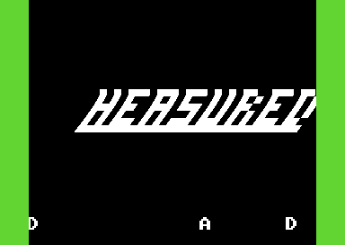
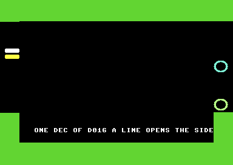
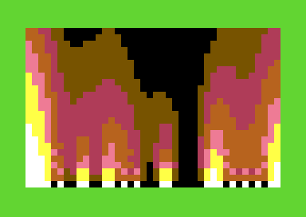
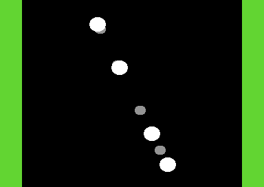

# MEASURED: a five-part C64 demo built from c64-kb

MEASURED is a demo for the stock Commodore 64, written in KickAssembler
from this knowledge base's techniques and recipes and nothing else. Every
effect on screen is a KB technique with a pinned recipe behind it. Every
part is a module with the six-stage lifecycle the KB's `part_lifecycle`
pattern describes; the sequencer calls the tune once a frame from the one
raster interrupt it owns, and each part ends when the tune reaches a
position. The whole thing runs headless under the KB's harness with a
verdict byte, a frame meter and pinned screenshots on PAL and NTSC.

`DESIGN.md` is the design it was built to: the part list, the contract
every part keeps, the memory map and the sync plan. `PLAN.md` is the
technique audit the KB's own tools produced before any code was written.
Where the build differs from the design it is listed under "Placeholder
and not built" below.

| Part 1 LOGO                                                             | Part 2 TWIST                                                                                 | Part 3 BORDER                                                                                   | Part 4 FIRE                                                   | Part 5 SPRITES                                                             |
| ----------------------------------------------------------------------- | -------------------------------------------------------------------------------------------- | ----------------------------------------------------------------------------------------------- | ------------------------------------------------------------- | -------------------------------------------------------------------------- |
|  |  |  |  |  |

Each picture is the PAL pin of the part's standalone test runner, frozen
at frame 300 with the runner's green pass border.

## The parts

The techniques and recipes are `DESIGN.md`'s table. The figures are each
part's own CIA1 timer A bracket of its per-frame work, interrupt work
summed with main-loop work, worst frame and typical frame, as printed on
the end screen of the AUTOPILOT build (`shots/pal.png` and
`shots/ntsc.png`, which print them as five digits).

| #   | Part    | KB techniques                                                                        | Recipes                                                                                                                                                                                                                                                                                                                   | PAL worst | PAL typical | NTSC worst | NTSC typical |
| --- | ------- | ------------------------------------------------------------------------------------ | ------------------------------------------------------------------------------------------------------------------------------------------------------------------------------------------------------------------------------------------------------------------------------------------------------------------------- | --------: | ----------: | ---------: | -----------: |
| 1   | LOGO    | tech_tech_wobbler, sprite_border_scroller, topbottom_border_open, stable_raster_irq | [tech-tech](../../docs/recipes/kickassembler/tech-tech.md), [sprite-border-scroller](../../docs/recipes/kickassembler/sprite-border-scroller.md)                                                                                                                                                                         |     8,004 |       4,042 |      9,826 |        3,636 |
| 2   | TWIST   | twister, vector_balls_sprites                                                        | [twister](../../docs/recipes/kickassembler/twister.md), [vector-balls](../../docs/recipes/kickassembler/vector-balls.md)                                                                                                                                                                                                   |    17,413 |      16,218 |      9,817 |        8,623 |
| 3   | BORDER  | dysp_side_border_sprites, soft_scroll_h                                              | [dysp](../../docs/recipes/kickassembler/dysp.md), [soft-scroll-h](../../docs/recipes/oscar64/soft-scroll-h.md) (ported from Oscar64)                                                                                                                                                                                       |    22,704 |      13,153 |     23,799 |       13,948 |
| 4   | FIRE    | fire_effect                                                                          | [fire-effect](../../docs/recipes/kickassembler/fire-effect.md)                                                                                                                                                                                                                                                             |    30,122 |      25,167 |     30,509 |       25,683 |
| 5   | SPRITES | sprites_only_screen_mode, vector_balls_sprites                                       | [sprites-only-screen](../../docs/recipes/kickassembler/sprites-only-screen.md), [vector-balls](../../docs/recipes/kickassembler/vector-balls.md)                                                                                                                                                                           |     2,300 |       1,364 |      2,141 |        1,354 |

Parts 1, 2, 3 and 5 leave through `colour_fade`
([colour-fade](../../docs/recipes/kickassembler/colour-fade.md)), a
luminance fade of the border, the background and the colour RAM. The
music is the three-voice player of
[sfx-in-player](../../docs/recipes/kickassembler/sfx-in-player.md),
extended with an order list per voice, a frames-per-row tempo and a
shared position byte the sequencer reads. Part 2's worst frame on PAL is
the twister's whole column copy; on NTSC the column is copied in two
halves on alternate frames, which is why its figure is about half.

The end screen also carries the harness meter, which brackets part 5's
main-loop work for its first 200 frames (the steady state with the most
sprites), separately from the parts' own brackets:

| Model | Frames | Worst | Typical |
| ----- | -----: | ----: | ------: |
| PAL   |    200 | 1,480 |   1,437 |
| NTSC  |    200 | 1,476 |   1,424 |

## Build and run

You need KickAssembler (Java), VICE 3.10's `x64sc`, `c1541`, Python 3
and make. The headless runs want a windowless `x64sc` so that no window
opens and steals focus; the KB builds one with `npm run vice:headless`.
Tool paths come from the environment or from a `local.mk` beside the
Makefile (`KICKASS_JAR`, `X64SC`, `X64SC_WINDOWED`, `C1541`), and without
either the harness falls back to its own defaults and then to `x64sc` on
the path; `make tools` prints what it found, and `verify.sh` runs the
emulator that `make tools` reports.

```
make                              # release build: build/measured.prg
make PLAN_GATE=off shot check     # AUTOPILOT build, end-screen shots on PAL and NTSC, graded against expect.json
make PLAN_GATE=off selftest       # the FORCE_FAULT build must fail the same checks
make PLAN_GATE=off disk           # build/measured.d64
bash verify.sh                    # all of the above, then a shot inside each part on both models, graded
make run                          # the windowed emulator on the release build
```

Or run the release build in any VICE: `x64sc build/measured.prg`.

`make` first runs the harness's plan gate. It checks that `PLAN.md`
holds the KB tools' output and, when it can reach the KB checkout two
directories up (`C64KB`, default `../..`), re-runs `check-compatibility`
on the plan's technique list and requires the verdict line `PLAN.md`
pasted. The graph moves as the KB grows, so the pasted verdict can go
stale and the gate refuses the build; `PLAN_GATE=off` skips it, and
`verify.sh` runs with it off.

The parts also run on their own. Each `test/pN_test.asm` includes
`test/stub.inc`, a minimal sequencer that runs one module through the
lifecycle, freezes it at frame 300, grades it and writes the verdict
byte; `test/music_test.asm` does the same for the player. Build one with
`java -jar KickAss.jar test/p3_test.asm -odir build -o build/p3_test.prg`,
run it headless with the same flags `verify.sh` uses and a cycle count
past the freeze, and grade the pair with
`python3 harness/check.py test/expect-p3.json shots/pal.png shots/ntsc.png`.
The pins in `test/shots/` are those pictures.

## The harness

`harness/` is a copy of the KB's `templates/_harness` as it stood when
the project was made, plus one addition the demo needs: an `ink` check in
`check.py`, an area with a background colour, a minimum and optional
maximum count of pixels that are not that background, and an optional
list of allowed colours. It exists for pictures whose elements move,
where a fixed rectangle would pin one phase: the fire and the orbiting
balls are graded with it. The template has since gained things this copy
lacks (a `dy` offset for text checks, the `released` and `zp` targets,
saturation in the frame meter), so do not overwrite this directory with
the template without carrying `ink` across.

## How it was verified

VICE x64sc 3.10, headless and in warp, on its default PAL machine (a
C64C) and `-model ntsc`. The counts below are from `verify.sh` run on
this tree; each check is counted once per model.

- **The end screen.** `make shot check` runs the AUTOPILOT build to
  100,000,000 cycles on PAL and 88,000,000 on NTSC, past part 5's fade
  (the derivation is in the Makefile), and `expect.json` grades the
  frozen end screen: the verdict byte and green border, the title and
  credits, the five part rows, the line `PARTS 5/5 PASS`, the frame
  meter's 200 frames, and the title area identical on both models. 21 of
  21 pass.
- **The fault build.** `make selftest` builds with `FORCE_FAULT`, which
  complements part 2's depth table so that its selfcheck fails and one
  ball is drawn behind another it should cover. The end screen then reads
  `PARTS 4/5 FAIL` with a red border and `check.py` rejects it on both
  models, so the checks are known to be able to fail.
- **Inside each part.** `verify.sh` takes a screenshot inside every
  part's dwell on both models, at cycle counts measured with the monitor
  and listed in the script, and grades it against `expect-pN-demo.json`.
  Those files hold frame-independent checks only: the border colour the
  part sets, areas the effect never reaches, `ink` counts over the region
  the fire or the balls always occupy, and areas identical on both
  models. Each also carries the verdict check `check.py` requires, which
  fails mid-demo by design and the script discounts; every other check
  passes.
- **Frozen at frame 300.** Each part's standalone runner grades a static
  picture against `test/expect-pN.json`: sprite boxes, lit and unlit
  pixels at positions the recipes' tables predict, text rows, and the
  part's own selfcheck through the verdict byte. The pins in `test/shots/`
  were taken from this tree, part 1 at 10,000,000 cycles and the others
  at 14,000,000, and pass those files on both models. Parts 2 to 5 and
  the music came out pixel-identical to the pins taken during
  development. Part 1's did not: its PAL/NTSC detection had since been
  put under SEI, which changed how many frames its `prepare` takes and so
  the wobble phase at the shot, and its white-rule check had been written
  for the old phase. That check now covers only the cells that are white
  at every phase (the wobble shifts a line by at most 55 pixels) and
  passes at every cycle count tried from 9 to 13 million.
- **Part 5 by eye.** The `ink` check counts the balls' pixels; the
  picture was also looked at at four points inside part 5 on PAL (76, 78,
  82 and 86 million cycles) and once on NTSC (70 million): six balls on
  black in each. The check that only asserted black areas had passed
  while the demo drew one grey ball, which is why `ink` exists.
- **The integration record.** Integrating five modules written by
  different hands surfaced thirteen issues, numbered I-001 to I-013,
  which comments and check names still cite by number. The record itself
  is working notes and is not in this tree. Its causes, in short: part
  5's projection tables had been assembled under the I/O area, so every
  lookup read a VIC register mirror and its selfcheck compared mirrored
  reads with registers written from the same reads; the per-part grading
  had never graded anything, because every demo expect file had a pixel
  check on a line NTSC has no row for and the script counted the
  checker's refusal as a pass; three of the four early `prepare` routines
  wrote zero page or bank 0 that the running part still read, so the
  sequencer now runs each `prepare` after the previous part's cleanup
  inside a black gap with the music on; part 1 wrote eight sprite-pointer
  bytes into the sequencer's end-screen code, and its PAL/NTSC detection
  spun on a raster bit that the line-255 interrupt covers on NTSC; part
  3's tables were assembled into bank 0 where part 1's matrices live;
  the fault build pushed part 2 over part 3's code base; and the frame
  meter moved when the real part 1 grew over it. The last check to be
  corrected was part 3's inside the demo, which had been written for a
  dummy module and expected a black border where the real module sets a
  dark grey one; it now asserts what the real part does, the side border
  closed above and below the band and open on every line of it.

## Placeholder and not built

- **The tune** is the original placeholder written for the KB's minimal
  player; a full player and a new score are in progress.
- **Part 1's font.** The scroller's A to Z at `$3800` are hand-typed
  8x8 glyphs doubled 2x2 into sprites, and the logo is a matrix of solid
  cells.
- **The M glyph.** The logo's M is drawn as two uprights with a bar and
  reads as an H at the wobble's resolution; part 1's selfcheck reads
  that cell pattern back.
- **The dissolve into part 4** that `DESIGN.md` names
  (`screen_dissolve_lfsr`) was not built; part 4 starts the fire on its
  first frame.
- **Part 5's dwell** is shorter than the design's. The tune's order list
  has 23 orders and loops back to 19, so the position that ends part 5 is
  22, three orders after part 4 ends.

## What it does not establish

- **Real hardware.** Every figure and every picture is VICE x64sc 3.10.
  Nothing here has run on a C64.
- **Sound.** The harness runs with `+sound`. The tune is graded by its
  position byte and its call count, not by listening, and nothing says
  how it sounds on a 6581 against an 8580.
- **The cycle budgets are this program's.** Each part's bracket sums its
  interrupt and main-loop work as written here, behind this sequencer's
  dispatcher and with this tune playing. They are not the cost of the
  techniques as the recipes measure them, and code layout alone moves a
  bracket by a few cycles.
- **Timing across regions.** The player is called every frame, so the
  tune and every dwell run faster on NTSC in the ratio of the frame
  rates; the parts end on the tune's position, so the demo stays in sync
  with itself.

## Files

| Path                                          | Holds                                                                                              |
| --------------------------------------------- | -------------------------------------------------------------------------------------------------- |
| `src/main.asm`                                | The sequencer: the IRQ dispatcher, the part table, the black gap, the fade, the end screen         |
| `src/api.inc`                                 | The numbers every module and the sequencer agree on: zero page, code bases, the verdict contract   |
| `src/parts/music.asm`                         | The player and the placeholder tune at `$1000`                                                     |
| `src/parts/p1_logo.asm` to `p5_sprites.asm`   | The five parts, one namespace each                                                                 |
| `test/stub.inc`, `test/*_test.asm`            | The standalone runners                                                                             |
| `test/expect-*.json`, `test/shots/`           | Their checks and pins                                                                              |
| `expect.json`, `expect-p*-demo.json`          | The end-screen checks and the inside-the-demo checks                                               |
| `shots/pal.png`, `shots/ntsc.png`             | The end-screen pins                                                                                |
| `harness/`                                    | The vendored harness (see above)                                                                   |
| `Makefile`, `verify.sh`                       | The build and the verification suite                                                               |
| `DESIGN.md`, `PLAN.md`                        | The design and the technique audit                                                                 |

## Licence

BSD-3-Clause, as the repository's [LICENSE](../../LICENSE): copyright
2026 Duncan Bowring. The player code the music module ports is the KB's
own, under the same licence.
