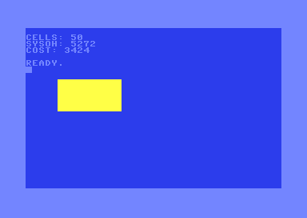

<!-- doc-type: recipe -->

# KickAssembler: BASIC calls a machine-code window routine through a zero-page parameter block

## Synopsis

A tokenized BASIC program POKEs five parameters (column, row, width,
height, colour) into zero page `$A5`–`$A9`, starts CIA2 timer A on the
same statement, calls the routine at `$0900` with `SYS 2304`, and
PEEKs the cell count back from `$AA`. The routine fills a rectangle on
the screen and in colour RAM, then stores draw cost at `$0340`–`$0341`.
`POKE 52,9:POKE 56,9:CLR` limits the BASIC string heap to `$0900` so
the routine is above the heap's reach. Demonstrates the pattern
Pirates! (1987) uses for every service block: POKE parameters, SYS
entry point, PEEK result.

## Source

```asm
// basic-ml-service-blocks.asm
// A tokenized BASIC program that POKEs five parameters (x, y, width,
// height, colour) into zero page $A5-$A9, SYSes a machine-code window-fill
// routine at $0900 (2304), and PEEKs the cell count back from $AA (170).
// CIA2 timer A measures SYS overhead (BASIC to ML entry) and the routine's
// draw cost; both are stored at $0340-$0343 (cassette buffer) and printed.
// Memory protection: POKE 52,9:POKE 56,9 before CLR caps BASIC's string
// heap at $0900, leaving the routine above the heap's reach.

.const ZP_X   = $A5
.const ZP_Y   = $A6
.const ZP_W   = $A7
.const ZP_H   = $A8
.const ZP_COL = $A9
.const ZP_RES = $AA

.const SCREEN  = $0400
.const COLOUR  = $D800
.const CIA2LO  = $DD04
.const CIA2HI  = $DD05
.const CIA2CTL = $DD0E
.const OVH_LO  = $0340
.const OVH_HI  = $0341
.const CST_LO  = $0342
.const CST_HI  = $0343
.const SCR_PTR = $FB
.const COL_PTR = $FD

// Tokenized BASIC program at $0801 (petcat -w2 output):
//  5 PRINT CHR$(147)
// 10 POKE52,9:POKE56,9:CLR
// 20 POKE165,5:POKE166,8:POKE167,10:POKE168,5:POKE169,7
// 30 POKE56580,255:POKE56581,255:POKE56590,17:SYS 2304
// 40 PRINT"CELLS:";PEEK(170)
// 50 PRINT"SYSOH:";PEEK(832)+256*PEEK(833)
// 60 PRINT"COST:";PEEK(834)+256*PEEK(835)

* = $0801
.byte $0e,$08,$05,$00,$99,$20,$c7,$28,$31,$34,$37,$29,$00
.byte $20,$08,$0a,$00,$97,$35,$32,$2c,$39,$3a,$97,$35,$36,$2c,$39,$3a,$9c,$00
.byte $48,$08,$14,$00,$97,$31,$36,$35,$2c,$35,$3a,$97,$31,$36,$36,$2c,$38,$3a,$97,$31,$36,$37,$2c,$31,$30,$3a,$97,$31,$36,$38,$2c,$35,$3a,$97,$31,$36,$39,$2c,$37,$00
.byte $73,$08,$1e,$00,$97,$35,$36,$35,$38,$30,$2c,$32,$35,$35,$3a,$97,$35,$36,$35,$38,$31,$2c,$32,$35,$35,$3a,$97,$35,$36,$35,$39,$30,$2c,$31,$37,$3a,$9e,$20,$32,$33,$30,$34,$00
.byte $88,$08,$28,$00,$99,$22,$43,$45,$4c,$4c,$53,$3a,$22,$3b,$c2,$28,$31,$37,$30,$29,$00
.byte $a8,$08,$32,$00,$99,$22,$53,$59,$53,$4f,$48,$3a,$22,$3b,$c2,$28,$38,$33,$32,$29,$aa,$32,$35,$36,$ac,$c2,$28,$38,$33,$33,$29,$00
.byte $c7,$08,$3c,$00,$99,$22,$43,$4f,$53,$54,$3a,$22,$3b,$c2,$28,$38,$33,$34,$29,$aa,$32,$35,$36,$ac,$c2,$28,$38,$33,$35,$29,$00
.byte $00,$00

// Machine-code window-fill routine at $0900 = SYS 2304
// On entry: CIA2 timer A counts from $FFFF (started by BASIC's POKE 56590,17
//   on the same statement as SYS 2304).
// Zero-page parameters (set by BASIC POKE before SYS):
//   $A5=col, $A6=row, $A7=width, $A8=height, $A9=colour nibble (0-15).
// Result:
//   $AA = cells drawn (= width x height); BASIC reads it with PEEK(170).
//   $0340-$0341 = SYS overhead low/high (PEEK 832/833).
//   $0342-$0343 = draw cost low/high (PEEK 834/835).

* = $0900

window_routine:
    // Stop CIA2 timer A; capture SYS overhead.
    lda #$00
    sta CIA2CTL
    sec
    lda #$ff
    sbc CIA2LO
    sta OVH_LO
    lda #$ff
    sbc CIA2HI
    sta OVH_HI

    // Restart timer for routine draw cost.
    lda #$ff
    sta CIA2LO
    sta CIA2HI
    lda #$11              // force load + start, continuous
    sta CIA2CTL

    // Compute screen address: SCREEN + ZP_Y * 40 + ZP_X.
    lda #<SCREEN
    sta SCR_PTR
    lda #>SCREEN
    sta SCR_PTR+1
    ldx ZP_Y
    beq addr_done
row_loop:
    clc
    lda SCR_PTR
    adc #40
    sta SCR_PTR
    bcc row_nc
    inc SCR_PTR+1
row_nc:
    dex
    bne row_loop
addr_done:
    clc
    lda SCR_PTR
    adc ZP_X
    sta SCR_PTR
    bcc col_nc
    inc SCR_PTR+1
col_nc:

    // Colour pointer = screen pointer + $D400 (= COLOUR - SCREEN).
    clc
    lda SCR_PTR
    adc #<(COLOUR - SCREEN)
    sta COL_PTR
    lda SCR_PTR+1
    adc #>(COLOUR - SCREEN)
    sta COL_PTR+1

    lda ZP_H
    sta row_cnt
    lda ZP_W
    sta w_orig
    lda #0
    sta cell_cnt

draw_row:
    lda row_cnt
    beq draw_done
    dec row_cnt
    lda w_orig
    sta col_cnt

draw_col:
    lda col_cnt
    beq end_col
    dec col_cnt
    lda #$a0              // reversed space = solid block in screen codes
    ldy #0
    sta (SCR_PTR),y
    lda ZP_COL
    sta (COL_PTR),y
    inc cell_cnt
    inc SCR_PTR
    bne no_sw
    inc SCR_PTR+1
no_sw:
    inc COL_PTR
    bne no_cw
    inc COL_PTR+1
no_cw:
    jmp draw_col

end_col:
    // Advance pointers by (40 - w_orig) to reach column x of the next row.
    lda #40
    sec
    sbc w_orig
    clc
    adc SCR_PTR
    sta SCR_PTR
    bcc no_sw2
    inc SCR_PTR+1
no_sw2:
    lda #40
    sec
    sbc w_orig
    clc
    adc COL_PTR
    sta COL_PTR
    bcc no_cw2
    inc COL_PTR+1
no_cw2:
    jmp draw_row

draw_done:
    lda cell_cnt
    sta ZP_RES

    // Stop timer; record draw cost.
    lda #$00
    sta CIA2CTL
    sec
    lda #$ff
    sbc CIA2LO
    sta CST_LO
    lda #$ff
    sbc CIA2HI
    sta CST_HI

    rts

row_cnt:  .byte 0
w_orig:   .byte 0
col_cnt:  .byte 0
cell_cnt: .byte 0
```

## Build

```sh
java -jar $KICKASS_JAR basic-ml-service-blocks.asm -o basic-ml-service-blocks.prg
```

## Expected output

PAL (C64C, 8565, 8580, 8521) and NTSC produce the same layout. The PRG
is 472 bytes; the gap from `$08C9` to `$08FF` is zeros.

Screen (text mode, `$D018=$15`, screen at `$0400`, colour RAM at `$D800`):

- Row 1: `CELLS: 50` — the routine drew 10 × 5 = 50 cells.
- Row 2: `SYSOH: 4924` — measured in VICE x64sc 3.10, CIA2 timer A,
  PAL (rung 1). This is the interval from `POKE 56590,17` (starting the
  timer) to the routine's `STA $DD0E` (stopping it), which covers `:SYS
  2304` statement dispatch and argument evaluation. BASIC evaluates
  `2304` as a float, costing roughly 3,000 of the 4,924 cycles; the
  remaining ~1,900 cycles are the colon separator, SYS handler dispatch
  and JSR. The backward overhead (routine `RTS` to BASIC resuming `PRINT`)
  is symmetric: about 300–400 cycles for the JSR frame pop plus the BASIC
  statement iterator (rung 3, arithmetic).
- Row 3: `COST: 3381` — measured in VICE x64sc 3.10, CIA2 timer A, PAL
  (rung 1). The routine draws 50 cells: 10 columns × 5 rows of
  `$A0` (solid block) with colour 7 (yellow) starting at screen row 8,
  column 5. About 68 cycles per cell (rung 3, arithmetic from 50 cells ÷
  3381 cycles); the remainder is address setup and row-advance overhead.
- Row 5: `READY.` — BASIC's normal end-of-program prompt.
- Rows 8–12, columns 5–14: a 10 × 5 yellow solid-block rectangle.



## Why this works

BASIC stores the program in tokenised form in RAM starting at `$0801`.
It interprets, not compiles: every `POKE` writes directly to the
zero-page byte, and every `PEEK` reads from it. The `SYS addr` statement
evaluates its argument as a BASIC float (hence the 3,000-cycle argument
cost for `2304`), converts it to a 16-bit integer, and JSRs there with
`$01` still `$37` (BASIC ROM visible). The routine returns with `RTS`
and BASIC resumes at the next token.

`POKE 52,9:POKE 56,9` writes `$09` into `FRETOP`'s high byte (`$34`)
and `MEMSIZ`'s high byte (`$38`). `CLR` resets the string heap so
`FRETOP` = `MEMSIZ` = `$0900`. Strings can only be allocated below
`$0900`, so the routine at `$0900` is never reached by the heap. The
routine itself is loaded by the PRG at `$0900`; it sits above the heap's
reach throughout the program's lifetime. This is the same mechanism
Pirates! (1987) uses: line 4 of that program does
`POKE 52,142:POKE 56,142:CLR`, capping the heap at `$8E00` while the
service blocks live at `$9500`–`$9EFF` (rung 1, memory-map/findings.txt).

The large-PRG trap: placing ML in a PRG at `$C000` creates a
~47 KB file. VICE's `autostartprgmode 1` (direct RAM injection) sets
`VARTAB` to the end of the injected data rather than to the end of the
BASIC text. A subsequent `POKE 56,192:CLR` with `MEMSIZ` below the
injected end crashes BASIC's heap accounting. Keeping the routine near
the program end (here `$0900`) avoids the gap and keeps `VARTAB` correct.

CIA2 timer A (`$DD04`–`$DD05`, control `$DD0E`) is safe during a BASIC
program because the KERNAL jiffy clock uses CIA1 timer A and the serial
bus uses `$DD00`; it does not use CIA2 timers. Reading `$DD0E` bit 0
after stopping confirms the timer halted. An NMI cannot fire from CIA2
timer A unless CIA2 `IER` bit 0 is set; BASIC never sets it.
