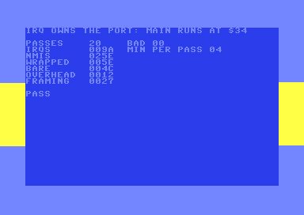

<!-- doc-type: recipe -->

# KickAssembler — IRQ and NMI handlers that own $01 while main code runs at $34

## Synopsis

Main code sets `$01` = `$34` (all RAM, no I/O) and, 32 times over,
copies 4 KB into the RAM under `$D000-$DFFF` and checks it by a 16-bit
sum, alternating a plain and an inverted copy so each pass has to write
every byte. Interrupts stay on throughout: a raster IRQ turns the border
yellow on line 120, a second one turns it back on line 200 and steps a
tiny SID player, and a CIA2 timer NMI fires every 5,000 cycles. Every
handler saves `$01` on the stack, stores `#$35`, does its work and
stores the saved value back. The KERNAL is banked out, so the CPU takes
both vectors from the RAM at `$FFFA-$FFFF`. The program prints the pass
count, the bad sums, how many times the line-200 handler and the NMI
ran, the fewest line-200 handler runs seen in any one pass, and the
cycles of the line-120 handler with and without the `$01` wrapper.
Verdict for a harness: `$02FF` = `$01` and `PASS` when every sum
matched and every pass saw an interrupt, `$02` and `FAIL` otherwise.

## Source

```asm
// irq-owns-port.asm
// Main code runs with $01 = $34 (all RAM, no I/O) and copies 4 KB into
// the RAM under $D000-$DFFF, then checks it by a 16-bit sum, 32 times,
// plain and inverted in turn. Meanwhile two raster IRQs change the
// border colour on lines 120 and 200, the second one also steps a tiny
// SID player, and a CIA2 timer NMI counts. Every handler saves $01,
// stores #$35, does its work, and puts the saved value back. The
// KERNAL is banked out, so the CPU takes its vectors from the RAM at
// $FFFA-$FFFF. The program prints the pass count, the bad sums, the
// IRQ and NMI counts, the fewest IRQs seen in any one pass, and the
// cycles of the line-120 handler with and without the $01 wrapper.
// Verdict for a harness: $02FF = $01 when every sum matched and every
// pass saw an IRQ, $02 otherwise.
// -define NO_SET35    builds the broken handler (it never sets $35).
// -define RESTORE35   builds a handler that restores #$35, not the saved value.

BasicUpstart2(start)
.encoding "screencode_upper"

.const SCREEN   = $0400
.const RESULT   = $02ff
.const BORDER   = $d020
.const DEST     = $d000          // the RAM under I/O
.const SRC      = $4000          // 4 KB source pattern
.const PASSES   = 32
.const LINE_A   = 120            // border to yellow
.const LINE_B   = 200            // border back, player, frame count
.const NMI_LAT  = 4999           // CIA2 timer A period for the NMI

.const src = $fb
.const dst = $fd

// Expected sums, computed by the assembler from the same formula as the
// source data: the plain copy and the inverted copy.
.function pat(i) { .return ((i * 37) + (i >> 8) * 11 + 5) & $ff }
.var s_plain = 0
.for (var i = 0; i < 4096; i++) { .eval s_plain = s_plain + pat(i) }
.const SUM_PLAIN = s_plain & $ffff
.const SUM_INV   = (4096 * 255 - s_plain) & $ffff

// ------------------------------------------------------------- wrapper
// Enter: save the interrupted $01 on the stack, make I/O visible.
.macro PortIn() {
    lda $01
    pha
#if !NO_SET35
    lda #$35
    sta $01
#endif
}
// Leave: put back exactly what the interrupted code had.
.macro PortOut() {
    pla
#if RESTORE35
    lda #$35
#endif
    sta $01
}

// Handler A body: border yellow, chain to line B. wrap selects the
// wrapper so the same body can be timed with and without it.
.macro HandlerA(wrap) {
    pha
    .if (wrap) { PortIn() }
    lda #7
    sta BORDER
    lda #LINE_B
    sta $d012
    lda #<irq_b
    sta $fffe
    lda #>irq_b
    sta $ffff
    lda #$01
    sta $d019
    .if (wrap) { PortOut() }
    pla
    rti
}

// ---------------------------------------------------------------- main
start:
    jsr $e544                    // KERNAL clear screen, while it is still in
    sei
    lda #$7f
    sta $dc0d                    // CIA1: no interrupts
    sta $dd0d                    // CIA2: no NMIs yet
    lda $dc0d
    lda $dd0d
    lda #0
    sta $d01a
    lda #$ff
    sta $d019
    // Vectors into the RAM under the KERNAL: writes go to RAM even now.
    lda #<irq_a
    sta $fffe
    lda #>irq_a
    sta $ffff
    lda #<nmi
    sta $fffa
    lda #>nmi
    sta $fffb
    lda #$35                     // KERNAL and BASIC out, I/O in
    sta $01

    // 1. Time handler A with and without the wrapper (CIA1 timer A).
    lda #$34
    sta call_port
    lda #<bare_a
    ldx #>bare_a
    jsr time_call
    stx t_bare
    sty t_bare+1
    lda #<irq_a
    ldx #>irq_a
    jsr time_call
    stx t_full
    sty t_full+1
    lda #<rti_only
    ldx #>rti_only
    jsr time_call
    stx t_empty
    sty t_empty+1
    lda #<irq_a                  // timing moved the chain: reset it
    sta $fffe
    lda #>irq_a
    sta $ffff

    // 2. Raster IRQ at LINE_A, CIA2 NMI, SID voice 1.
    lda $d011
    and #$7f
    sta $d011
    lda #LINE_A
    sta $d012
    lda #$ff
    sta $d019
    lda #$01
    sta $d01a
    lda #<NMI_LAT
    sta $dd04
    lda #>NMI_LAT
    sta $dd05
    lda #$81
    sta $dd0d
    lda #$11
    sta $dd0e
    lda #$0f
    sta $d418
    lda #$09
    sta $d405
    lda #$00
    sta $d406
    cli

    // 3. The test: all RAM, interrupts live.
    lda #$34
    sta $01
    lda #$ff
    sta min_irq
    lda #0
    sta pass
    sta bad
pass_loop:
    lda irq_count
    sta pass_start
    lda pass
    and #1
    bne !+
    jsr copy_plain
    jmp !++
!:  jsr copy_inv
!:  jsr checksum
    lda pass
    and #1
    bne !+
    lda sum
    cmp #<SUM_PLAIN
    bne pass_bad
    lda sum+1
    cmp #>SUM_PLAIN
    bne pass_bad
    jmp pass_ok
!:  lda sum
    cmp #<SUM_INV
    bne pass_bad
    lda sum+1
    cmp #>SUM_INV
    bne pass_bad
    jmp pass_ok
pass_bad:
    inc bad
pass_ok:
    lda irq_count
    sec
    sbc pass_start
    cmp min_irq
    bcs !+
    sta min_irq
!:  inc pass
    lda pass
    cmp #PASSES
    bne pass_loop
    lda #$35                     // test over: I/O back for main code
    sta $01

    // 4. Report.
    PrintAt(0, 0, t_title)
    PrintAt(2, 0, t_pass_l)
    Hex8At(2, 10, pass)
    PrintAt(2, 16, t_bad_l)
    Hex8At(2, 20, bad)
    PrintAt(3, 0, t_irq_l)
    Hex16At(3, 10, irq_count)
    PrintAt(3, 16, t_min_l)
    Hex8At(3, 29, min_irq)
    PrintAt(4, 0, t_nmi_l)
    Hex16At(4, 10, nmi_count)
    PrintAt(5, 0, t_full_l)
    Hex16At(5, 10, t_full)
    PrintAt(6, 0, t_bare_l)
    Hex16At(6, 10, t_bare)
    sec
    lda t_full
    sbc t_bare
    sta t_diff
    lda t_full+1
    sbc t_bare+1
    sta t_diff+1
    PrintAt(7, 0, t_diff_l)
    Hex16At(7, 10, t_diff)
    PrintAt(8, 0, t_empty_l)
    Hex16At(8, 10, t_empty)
    lda bad
    bne fail
    lda min_irq
    beq fail
    lda #1
    sta RESULT
    PrintAt(10, 0, t_ok)
    jmp forever
fail:
    lda #2
    sta RESULT
    PrintAt(10, 0, t_ng)
forever:
    jmp forever

// ------------------------------------------------------------ handlers
irq_a:
    HandlerA(true)

irq_b:
    pha
    PortIn()
    txa
    pha
    lda #14
    sta BORDER
    inc irq_count
    bne !+
    inc irq_count+1
!:  // Player: one note per 8 frames from an 8-note table, gate on.
    inc frame
    lda frame
    lsr
    lsr
    lsr
    and #7
    tax
    lda notes_lo, x
    sta $d400
    lda notes_hi, x
    sta $d401
    lda #$11
    sta $d404
    lda #LINE_A
    sta $d012
    lda #<irq_a
    sta $fffe
    lda #>irq_a
    sta $ffff
    lda #$01
    sta $d019
    pla
    tax
    PortOut()
    pla
    rti

// CIA2 timer NMI (and RESTORE): same wrapper, its own stack slot, so it
// is safe even when it lands inside an IRQ handler's wrapper.
nmi:
    pha
    PortIn()
    lda $dd0d                    // acknowledge CIA2, or NMIs stop
    inc nmi_count
    bne !+
    inc nmi_count+1
!:  PortOut()
    pla
    rti

// The same body as irq_a without the wrapper, for timing only.
bare_a:
    HandlerA(false)

// The framing alone: time_call's pushes, jump and exit around an RTI.
rti_only:
    rti

// time_call: run the handler at A/X as an interrupt would (return
// address and status pushed, then RTI), with $01 = call_port during the
// call, timed by CIA1 timer A. Returns cycles in X (lo) / Y (hi),
// including the framing that rti_only measures alone.
time_call:
    sta tc_jmp+1
    stx tc_jmp+2
    lda #252                     // start in the lower border: no badline
!:  cmp $d012                    // or sprite DMA can steal from the window
    bne !-
    lda #$ff
    sta $dc04
    sta $dc05
    lda #$19                     // one-shot, force load, start
    sta $dc0e
    lda call_port
    sta $01
    lda #>tc_ret
    pha
    lda #<tc_ret
    pha
    php
tc_jmp:
    jmp $ffff
tc_ret:
    lda #$35
    sta $01
    lda #$00
    sta $dc0e
    sec
    lda #$ff
    sbc $dc04
    tax
    lda #$ff
    sbc $dc05
    tay
    rts

// ------------------------------------------------------------- copies
copy_plain:
    ldx #0
cp_loop:
    .for (var p = 0; p < 16; p++) {
        lda SRC + p * 256, x
        sta DEST + p * 256, x
    }
    inx
    beq cp_done
    jmp cp_loop
cp_done:
    rts

copy_inv:
    ldx #0
ci_loop:
    .for (var p = 0; p < 16; p++) {
        lda SRC + p * 256, x
        eor #$ff
        sta DEST + p * 256, x
    }
    inx
    beq ci_done
    jmp ci_loop
ci_done:
    rts

checksum:
    lda #0
    sta sum+1
    ldx #0
    clc                          // carry stays clear between bytes
cs_loop:
    .for (var p = 0; p < 16; p++) {
        adc DEST + p * 256, x    // A holds the low byte of the sum
        bcc skip
        inc sum+1
        clc
skip:
    }
    inx
    beq cs_done
    jmp cs_loop
cs_done:
    sta sum
    rts

// -------------------------------------------------------------- print
.macro PrintAt(row, col, text) {
    lda #<(SCREEN + row * 40 + col)
    sta dst
    lda #>(SCREEN + row * 40 + col)
    sta dst+1
    lda #<text
    sta src
    lda #>text
    sta src+1
    jsr print
}
.macro Hex16At(row, col, slot) {
    lda #<(SCREEN + row * 40 + col)
    sta dst
    lda #>(SCREEN + row * 40 + col)
    sta dst+1
    ldy #0
    lda slot+1
    jsr hex_byte
    lda slot
    jsr hex_byte
}
.macro Hex8At(row, col, slot) {
    lda #<(SCREEN + row * 40 + col)
    sta dst
    lda #>(SCREEN + row * 40 + col)
    sta dst+1
    ldy #0
    lda slot
    jsr hex_byte
}

print:
    ldy #0
!:  lda (src), y
    beq !+
    sta (dst), y
    iny
    bne !-
!:  rts

hex_byte:
    pha
    lsr
    lsr
    lsr
    lsr
    jsr hex_digit
    pla
    and #$0f
hex_digit:
    cmp #10
    bcc !+
    sbc #9                       // carry set: A-F are screen codes 1-6
    jmp !++
!:  ora #$30
!:  sta (dst), y
    iny
    rts

// --------------------------------------------------------------- data
notes_lo: .byte $c3, $d1, $ef, $1f, $60, $b5, $1e, $87
notes_hi: .byte $10, $12, $14, $15, $18, $1a, $1d, $20

t_title:  .text "IRQ OWNS THE PORT: MAIN RUNS AT $34"
          .byte 0
t_pass_l: .text "PASSES"
          .byte 0
t_bad_l:  .text "BAD"
          .byte 0
t_irq_l:  .text "IRQS"
          .byte 0
t_min_l:  .text "MIN PER PASS"
          .byte 0
t_nmi_l:  .text "NMIS"
          .byte 0
t_full_l: .text "WRAPPED"
          .byte 0
t_bare_l: .text "BARE"
          .byte 0
t_empty_l: .text "FRAMING"
          .byte 0
t_diff_l: .text "OVERHEAD"
          .byte 0
t_ok:     .text "PASS"
          .byte 0
t_ng:     .text "FAIL"
          .byte 0

call_port:  .byte 0
irq_count:  .word 0
nmi_count:  .word 0
frame:      .byte 0
pass:       .byte 0
pass_start: .byte 0
min_irq:    .byte 0
bad:        .byte 0
sum:        .word 0
t_full:     .word 0
t_bare:     .word 0
t_diff:     .word 0
t_empty:    .word 0

* = SRC "source pattern"
.for (var i = 0; i < 4096; i++) { .byte pat(i) }
```

## Build

```bash
java -jar $KICKASS_JAR irq-owns-port.asm -o irq-owns-port.prg
# the two broken handlers described under "Why this works":
java -jar $KICKASS_JAR irq-owns-port.asm -define NO_SET35 -o no-set35.prg
java -jar $KICKASS_JAR irq-owns-port.asm -define RESTORE35 -o restore35.prg
```

Run headless (pinned in `recipes/runs.json`, 8,000,000 cycles, PAL and
NTSC):

```bash
x64sc -default -warp +sound +autostart-delay-random -autostartprgmode 1 \
  -limitcycles 8000000 [-model ntsc] -exitscreenshot out.png -autostart irq-owns-port.prg
```

## Expected output



Measured in VICE x64sc 3.10 from the exit screenshots, which were
identical byte for byte over two runs of each model. The numbers on
screen are hex.

| Line on screen | PAL | NTSC |
|---|---|---|
| `PASSES` / `BAD` | `20` / `00` (32 passes, no bad sum) | `20` / `00` |
| `IRQS` (line-200 handler runs) | `009A` (154) | `00B3` (179) |
| `MIN PER PASS` | `04` | `05` |
| `NMIS` | `025E` (606) | `0264` (612) |
| `WRAPPED` | `005E` (94) | `005E` |
| `BARE` | `004C` (76) | `004C` |
| `OVERHEAD` | `0012` (18) | `0012` |
| `FRAMING` | `0027` (39) | `0027` |
| verdict | `PASS` | `PASS` |

The counters are read once, just after the last pass. 154 PAL frames at
19,656 cycles is about 3.03 million cycles, which at one NMI per 5,000
cycles is 606 NMIs, the figure on screen (arithmetic from the counts).

The border, measured with PIL at x = 4 (left border) and x = 380
(right border): PAL rows 0-103 light blue, row 104 light blue on the
left and yellow on the right, rows 105-183 yellow, row 184 yellow on
the left and light blue on the right, rows 185-271 light blue. Rows 104
and 184 are raster lines 120 and 200 (row = line - 16): the colour
changes part-way along the line the IRQ was set for, because the IRQ
is not stabilised. NTSC is the same with rows 92 and 172 (row = line
- 28). The band shows the raster chain still running at exit, when main code
is back at `$35`. The evidence that the handlers ran while main code was
at `$34` is the counters: `MIN PER PASS` is non-zero and `BAD` is 00.

## Why this works

**The wrapper.** Each handler begins `PHA`, `LDA $01`, `PHA`,
`LDA #$35`, `STA $01` and ends `PLA`, `STA $01`, `PLA`, `RTI`. `$35`
keeps the ROMs out and makes I/O visible, whatever the interrupted code
had. The saved value goes on the stack, not in a fixed byte, so an NMI
that lands inside an IRQ handler's wrapper saves and restores its own
copy; with a shared save byte the NMI would overwrite the IRQ's saved
`$34` with `$35` and the IRQ would return main code into the I/O
window. `ORA #$01` in place of the `$35` store does not work in
general: from `$30` it gives `$31`, the character ROM, not I/O.

**The vectors.** `$01` = `$34` and `$35` both have HIRAM clear, so the
CPU fetches the IRQ and NMI vectors from the RAM at `$FFFE/$FFFF` and
`$FFFA/$FFFB`, not from the KERNAL. The program writes them before it
banks the KERNAL out; the writes reach RAM even while the ROM is in
(`ram_under_rom_traps`). `$0314` and `$0318` are never read. The
raster chain rewrites `$FFFE/$FFFF` from inside the handlers.

**The NMI.** `SEI` does not stop an NMI, and the RESTORE key or CIA2
can raise one while `$01` = `$34`. The NMI handler here has the same
wrapper and reads `$DD0D` to acknowledge CIA2; without `$35` that read
reaches RAM, the CIA's flag stays set, `/NMI` never goes high again,
and no further NMI edge can occur (pitfall
`kernal_nmi_handler_runs_stop_check` in `pitfalls/cia.md`).

**The timing.** `time_call` enters a handler as an interrupt would:
return address and status on the stack, then a jump; the handler's
`RTI` comes back to `time_call`. CIA1 timer A counts the window, which
starts on raster line 252 so no badline or sprite fetch falls in it.
`$01` is `$34` for the call. `rti_only` measures the framing alone (39
cycles, its `RTI` included). The line-120 handler is 94 − 39 + 6 = 61
cycles wrapped and 43 bare, each plus 7 cycles for the interrupt
sequence itself (arithmetic from the instruction table, not in the
window). The difference, 18, is the wrapper: `LDA zp` 3, `PHA` 3,
`LDA #` 2, `STA zp` 3, `PLA` 4, `STA zp` 3, which is also what the
instruction table gives. The same figures on PAL and NTSC.

**The negative runs.** Both were run in VICE x64sc 3.10 (PAL, and the
first also NTSC) and probed through the remote monitor after 60 to 115
million cycles; neither is the pinned listing.

- `-define NO_SET35`: the handlers save and restore `$01` but never
  store `$35`. The screen stays blank blue with no yellow band and
  nothing printed. The monitor showed the pass counter at 0, the PC
  inside a handler, the NMI count at 1 and the line-200 count at
  `$9A29` (PAL, 115 million cycles; NTSC `$7133` at 100 million). The
  `$D019` acknowledge went to RAM, so the VIC's interrupt stayed
  asserted and the two handlers re-entered each other for ever,
  swapping the vector each time; main code never ran another pass. The
  NMI ran once and stopped, its `$DD0D` read having gone to RAM. With
  `$01` = `$34` the monitor showed the handlers' register writes in
  the RAM copy: `$D012` = `$78`, `$D019` = `$01`, `$D020` = `$07`,
  `$D400`/`$D401`/`$D404` = a note and `$11`. Had the main loop run
  on, those bytes would have failed the sum.
- `-define RESTORE35`: the handlers set `$35` but restore `$35`
  instead of the saved value. The first interrupt returns main code
  into the I/O window mid-copy, and the copy writes its pattern into
  the VIC, SID and CIA registers: the exit screenshot is a black screen
  with coloured streaks and a striped border. The monitor showed the
  pass counter at 0 and the NMI count at 1 at 95 million cycles, and
  the PC inside a handler in both probes (60 and 95 million). That the stray pattern bytes enabled
  a CIA1 interrupt source no handler acknowledges is the likely reason
  the handlers never stop (`$DC0D` read `$01` in the monitor); it was
  not traced further.

**The copy.** 16 `LDA abs,X` / `STA abs,X` pairs per `X` step, 256
steps; the checksum keeps the low byte of the sum in A and carries into
the high byte. The expected sums are computed by the assembler from the
same function that generates the source bytes, so the listing carries
no magic numbers. A 16-bit sum is weak, but every failure above is
gross.

Sources for the pattern: the Sparkle 3.4 user manual, section "Loading
to the RAM under I/O registers ($D000-$DFFF)", in
https://github.com/spartaomg/SparkleCPP (the loader decrunches with
`$01` = `$34` and requires IRQs to save, set `$35` and restore). The
code here is original.
