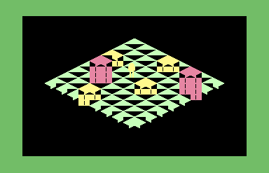

<!-- doc-type: recipe -->

# KickAssembler -- Isometric room with painter's order and sprite depth

## Synopsis

Demonstrates the `isometric_tile_engine` technique on stock hardware: a fixed
8-by-8 cell map drawn in painter's diagonal order into a 40-by-25 text screen,
hardware sprite 0 as the player figure, and `$D01B` bit 0 toggled by a scan of
the cells in front of the player. Three tile shapes (floor diamond, 4 chars
wide by 2 tall; one-tile block, 4 by 4; two-tile tall block, 4 by 6)
are built from 13 custom glyphs in a 2 KB charset at `$3000`. CIA 1 timer A
measures two full room redraws and a single block draw. A four-cell verdict at
`$02FF` checks the drawing.

Use this recipe as the starting point for any isometric tile engine that needs
the depth bit: replace the map and charset, keep the painter loop and depth
scan.

## Source

```asm
// KickAssembler 5.25
// isometric-room.asm: painter's order and one-bit sprite depth
// 8x8 isometric room in character mode (40x25), custom 2KB charset at $3000.
// Hardware sprite 0 as player; $D01B bit 0 updated after each move.
// Scripted path: (1,1)->(2,1)->(3,1)->(3,2)->(3,3)->(2,3).
// CIA1 timer A measures two full redraws and one block draw.
// Verdict at $02FF; depth-set move count at $02FE.
// Border: light blue during run -> green if $02FF=1, red otherwise.

*= $0801
:BasicUpstart2(main)

// ── VIC / CIA ────────────────────────────────────────────────────────────────
.const D018  = $D018
.const D020  = $D020
.const D021  = $D021
.const D015  = $D015
.const D01B  = $D01B
.const D027  = $D027
.const SPX0  = $D000
.const SPY0  = $D001
.const SPXHI = $D010
.const TALO  = $DC04
.const TAHI  = $DC05
.const TACRA = $DC0E

// ── Memory layout ────────────────────────────────────────────────────────────
.const SCR    = $0400
.const COLRAM = $D800
.const CSET   = $3000
.const SPDAT  = $2000
.const SPPTR  = $07F8

// ── Isometric constants ───────────────────────────────────────────────────────
.const OC = 18
.const OR = 4

// ── Custom char codes ─────────────────────────────────────────────────────────
.const CT0 = 1
.const CT1 = 2
.const CT2 = 3
.const CT3 = 4
.const CB0 = 5
.const CB1 = 6
.const CB2 = 7
.const CB3 = 8
.const CS0 = 9
.const CS1 = 10
.const CS2 = 11
.const CS3 = 12

// ── Palette ───────────────────────────────────────────────────────────────────
.const COL_FLOOR = 13
.const COL_BLOCK = 7
.const COL_TALL  = 10
.const COL_PASS  = 5
.const COL_FAIL  = 2

// ── Result addresses ──────────────────────────────────────────────────────────
.const R_T1L = $02F0
.const R_T1H = $02F1
.const R_T2L = $02F2
.const R_T2H = $02F3
.const R_BKL = $02F4
.const R_BKH = $02F5
.const R_DEP = $02FE
.const R_VRD = $02FF

// ── Tables, map, variables at $0900 ──────────────────────────────────────────

*= $0900

scr_row_lo: .for (var r=0; r<25; r++) { .byte <(SCR + r*40) }
scr_row_hi: .for (var r=0; r<25; r++) { .byte >(SCR + r*40) }
col_row_lo: .for (var r=0; r<25; r++) { .byte <(COLRAM + r*40) }
col_row_hi: .for (var r=0; r<25; r++) { .byte >(COLRAM + r*40) }

room:
.byte 0,0,0,0,0,0,0,0
.byte 0,0,0,0,1,0,0,0
.byte 0,0,0,0,0,0,0,2
.byte 0,1,0,0,0,0,0,0
.byte 0,0,0,0,0,1,0,0
.byte 0,0,2,0,0,0,0,0
.byte 0,0,0,0,0,0,0,0
.byte 0,0,0,1,0,0,0,0

player_x:  .byte 1
player_y:  .byte 1
player_col:.byte 0
player_row:.byte 0
draw_col:  .byte 0
draw_row:  .byte 0
tile_col:  .byte 0
draw_s:    .byte 0
draw_xe:   .byte 0
draw_xs:   .byte 0
draw_xc:   .byte 0
draw_yc:   .byte 0
midx:      .byte 0

mtx: .byte 2,3,3,3,2
mty: .byte 1,1,2,3,3

// ── Sprite data at $2000 ──────────────────────────────────────────────────────
*= SPDAT
// 24x21 figure sprite (3 bytes/row)
.byte $00,$3C,$00  // row 0  head top
.byte $00,$7E,$00  // row 1
.byte $00,$FF,$00  // row 2
.byte $00,$FF,$00  // row 3
.byte $00,$7E,$00  // row 4  head
.byte $01,$FF,$80  // row 5  shoulders
.byte $01,$FF,$80  // row 6  body
.byte $01,$FF,$80  // row 7
.byte $01,$FF,$80  // row 8
.byte $01,$FF,$80  // row 9
.byte $01,$FF,$80  // row 10
.byte $00,$7E,$00  // row 11 waist
.byte $00,$66,$00  // row 12 legs
.byte $00,$66,$00  // row 13
.byte $00,$66,$00  // row 14
.byte $00,$66,$00  // row 15
.byte $00,$66,$00  // row 16
.byte $00,$66,$00  // row 17
.byte $00,$66,$00  // row 18
.byte $00,$66,$00  // row 19
.byte $00,$66,$00  // row 20
.byte $00           // padding

// ── Custom charset at $3000 ───────────────────────────────────────────────────
*= CSET

// Char 0: blank
.fill 8, 0

// Chars 1-4: top-face/floor row 0 (top half of 32x16 2:1 diamond)
// Row r (0-7): diamond left edge at col 14-2*r, right at 17+2*r (clamped to 0-31)
// Each char covers 8 columns. Bit 7=col0, bit 0=col7 within the char's span.
// Char 1: cols 0-7
.byte $00,$00,$00,$00,$03,$0F,$3F,$FF
// Char 2: cols 8-15
.byte $03,$0F,$3F,$FF,$FF,$FF,$FF,$FF
// Char 3: cols 16-23
.byte $C0,$F0,$FC,$FF,$FF,$FF,$FF,$FF
// Char 4: cols 24-31
.byte $00,$00,$00,$00,$C0,$F0,$FC,$FF

// Chars 5-8: top-face/floor row 1 (bottom half of diamond)
.byte $FF,$3F,$0F,$03,$00,$00,$00,$00   // char 5
.byte $FF,$FF,$FF,$FF,$FF,$FC,$F0,$C0   // char 6
.byte $FF,$FF,$FF,$FF,$FF,$3F,$0F,$03   // char 7
.byte $FF,$FC,$F0,$C0,$00,$00,$00,$00   // char 8

// Chars 9-12: side face (cube walls, two per face)
.byte $FF,$FF,$FF,$FF,$FF,$FF,$FF,$FF   // char 9  left-face col 0 solid
.byte $FF,$7F,$7F,$7F,$7F,$7F,$7F,$FF   // char 10 left-face col 1 (right edge line)
.byte $FF,$FE,$FE,$FE,$FE,$FE,$FE,$FF   // char 11 right-face col 0 (left edge line)
.byte $FF,$FF,$FF,$FF,$FF,$FF,$FF,$FF   // char 12 right-face col 1 solid

// Fill rest of 2KB charset with zeros
.fill CSET + $800 - *, 0

// ── Main code at $0A00 ────────────────────────────────────────────────────────
*= $0A00

main:
    sei
    lda #$1C
    sta D018
    lda #0
    sta D021
    lda #14
    sta D020
    lda #0
    sta D01B
    lda #0
    sta R_DEP
    sta R_VRD

    lda #(SPDAT/64)
    sta SPPTR
    lda #1
    sta D015
    lda #7
    sta D027
    lda #0
    sta SPXHI

    // Clear 1000 screen and colour bytes
    ldx #0
clrloop:
    lda #$20
    sta SCR+$000,x
    sta SCR+$100,x
    sta SCR+$200,x
    lda #0
    sta COLRAM+$000,x
    sta COLRAM+$100,x
    sta COLRAM+$200,x
    inx
    bne clrloop
    ldx #0
clrlast:
    lda #$20
    sta SCR+$300,x
    lda #0
    sta COLRAM+$300,x
    inx
    cpx #232
    bne clrlast

    // First redraw timed
    lda #$FF
    sta TALO
    sta TAHI
    lda #$19
    sta TACRA
    jsr draw_room
    lda #$08
    sta TACRA
    sec
    lda #$FF
    sbc TALO
    sta R_T1L
    lda #$FF
    sbc TAHI
    sta R_T1H

    // Time one block draw (block at (4,1): col=24, row=9)
    lda #24
    sta draw_col
    lda #9
    sta draw_row
    lda #$FF
    sta TALO
    sta TAHI
    lda #$19
    sta TACRA
    lda #COL_BLOCK
    jsr draw_block_tile
    lda #$08
    sta TACRA
    sec
    lda #$FF
    sbc TALO
    sta R_BKL
    lda #$FF
    sbc TAHI
    sta R_BKH

    // Initial player position
    lda #1
    sta player_x
    sta player_y
    jsr update_player

    // Scripted moves
    lda #0
    sta midx

mvloop:
    lda midx
    cmp #5
    beq mvdone
    // ~25-frame delay (7*256*256 iterations at ~7 cycles = ~3M cycles, ~3 frames PAL)
    // Using smaller value for speed; actual frame timing not critical for this recipe
    ldy #25
dly_a:
    ldx #0
dly_b:
    dex
    bne dly_b
    dey
    bne dly_a

    ldy midx
    lda mtx,y
    sta player_x
    lda mty,y
    sta player_y
    jsr update_player

    inc midx
    jmp mvloop

mvdone:
    ldy #25
fdly_a:
    ldx #0
fdly_b:
    dex
    bne fdly_b
    dey
    bne fdly_a

    // Second redraw timed
    lda #$FF
    sta TALO
    sta TAHI
    lda #$19
    sta TACRA
    jsr draw_room
    lda #$08
    sta TACRA
    sec
    lda #$FF
    sbc TALO
    sta R_T2L
    lda #$FF
    sbc TAHI
    sta R_T2H

    jsr check_verdict

    lda R_VRD
    cmp #1
    bne setred
    lda #COL_PASS
    jmp setborder
setred:
    lda #COL_FAIL
setborder:
    sta D020

spin:
    jmp spin

// ── setup_row: load $02/$03/$04/$05 for row in Y ─────────────────────────────
setup_row:
    lda scr_row_lo,y
    sta $02
    lda scr_row_hi,y
    sta $03
    lda col_row_lo,y
    sta $04
    lda col_row_hi,y
    sta $05
    rts

// ── draw_floor_tile: A=colour, draw_col/draw_row set ─────────────────────────
// 8 screen writes + 8 colour writes (2 rows of 4 chars)
draw_floor_tile:
    sta tile_col
    ldy draw_row
    jsr setup_row
    ldy draw_col
    lda #CT0
    sta ($02),y
    iny
    lda #CT1
    sta ($02),y
    iny
    lda #CT2
    sta ($02),y
    iny
    lda #CT3
    sta ($02),y
    ldy draw_col
    lda tile_col
    sta ($04),y
    iny
    sta ($04),y
    iny
    sta ($04),y
    iny
    sta ($04),y

    ldy draw_row
    iny
    jsr setup_row
    ldy draw_col
    lda #CB0
    sta ($02),y
    iny
    lda #CB1
    sta ($02),y
    iny
    lda #CB2
    sta ($02),y
    iny
    lda #CB3
    sta ($02),y
    ldy draw_col
    lda tile_col
    sta ($04),y
    iny
    sta ($04),y
    iny
    sta ($04),y
    iny
    sta ($04),y
    rts

// ── draw_block_tile: A=colour, draw_col/draw_row set ─────────────────────────
// 16 screen writes + 16 colour writes (4 rows of 4 chars)
draw_block_tile:
    sta tile_col
    // Row draw_row-2: top-face row 0
    ldy draw_row
    dey
    dey
    jsr setup_row
    ldy draw_col
    lda #CT0
    sta ($02),y
    iny
    lda #CT1
    sta ($02),y
    iny
    lda #CT2
    sta ($02),y
    iny
    lda #CT3
    sta ($02),y
    ldy draw_col
    lda tile_col
    sta ($04),y
    iny
    sta ($04),y
    iny
    sta ($04),y
    iny
    sta ($04),y
    // Row draw_row-1: top-face row 1
    ldy draw_row
    dey
    jsr setup_row
    ldy draw_col
    lda #CB0
    sta ($02),y
    iny
    lda #CB1
    sta ($02),y
    iny
    lda #CB2
    sta ($02),y
    iny
    lda #CB3
    sta ($02),y
    ldy draw_col
    lda tile_col
    sta ($04),y
    iny
    sta ($04),y
    iny
    sta ($04),y
    iny
    sta ($04),y
    // Row draw_row: side face
    ldy draw_row
    jsr setup_row
    ldy draw_col
    lda #CS0
    sta ($02),y
    iny
    lda #CS1
    sta ($02),y
    iny
    lda #CS2
    sta ($02),y
    iny
    lda #CS3
    sta ($02),y
    ldy draw_col
    lda tile_col
    sta ($04),y
    iny
    sta ($04),y
    iny
    sta ($04),y
    iny
    sta ($04),y
    // Row draw_row+1: side face
    ldy draw_row
    iny
    jsr setup_row
    ldy draw_col
    lda #CS0
    sta ($02),y
    iny
    lda #CS1
    sta ($02),y
    iny
    lda #CS2
    sta ($02),y
    iny
    lda #CS3
    sta ($02),y
    ldy draw_col
    lda tile_col
    sta ($04),y
    iny
    sta ($04),y
    iny
    sta ($04),y
    iny
    sta ($04),y
    rts

// ── draw_tall_tile: A=colour, draw_col/draw_row set ──────────────────────────
// 24 screen writes + 24 colour writes (6 rows of 4 chars)
draw_tall_tile:
    sta tile_col
    // Row draw_row-4: top-face row 0
    ldy draw_row
    dey
    dey
    dey
    dey
    jsr setup_row
    ldy draw_col
    lda #CT0
    sta ($02),y
    iny
    lda #CT1
    sta ($02),y
    iny
    lda #CT2
    sta ($02),y
    iny
    lda #CT3
    sta ($02),y
    ldy draw_col
    lda tile_col
    sta ($04),y
    iny
    sta ($04),y
    iny
    sta ($04),y
    iny
    sta ($04),y
    // Row draw_row-3: top-face row 1
    ldy draw_row
    dey
    dey
    dey
    jsr setup_row
    ldy draw_col
    lda #CB0
    sta ($02),y
    iny
    lda #CB1
    sta ($02),y
    iny
    lda #CB2
    sta ($02),y
    iny
    lda #CB3
    sta ($02),y
    ldy draw_col
    lda tile_col
    sta ($04),y
    iny
    sta ($04),y
    iny
    sta ($04),y
    iny
    sta ($04),y
    // Rows draw_row-2 through draw_row+1: four side face rows
    ldy draw_row
    dey
    dey
    jsr setup_row
    ldy draw_col
    lda #CS0
    sta ($02),y
    iny
    lda #CS1
    sta ($02),y
    iny
    lda #CS2
    sta ($02),y
    iny
    lda #CS3
    sta ($02),y
    ldy draw_col
    lda tile_col
    sta ($04),y
    iny
    sta ($04),y
    iny
    sta ($04),y
    iny
    sta ($04),y

    ldy draw_row
    dey
    jsr setup_row
    ldy draw_col
    lda #CS0
    sta ($02),y
    iny
    lda #CS1
    sta ($02),y
    iny
    lda #CS2
    sta ($02),y
    iny
    lda #CS3
    sta ($02),y
    ldy draw_col
    lda tile_col
    sta ($04),y
    iny
    sta ($04),y
    iny
    sta ($04),y
    iny
    sta ($04),y

    ldy draw_row
    jsr setup_row
    ldy draw_col
    lda #CS0
    sta ($02),y
    iny
    lda #CS1
    sta ($02),y
    iny
    lda #CS2
    sta ($02),y
    iny
    lda #CS3
    sta ($02),y
    ldy draw_col
    lda tile_col
    sta ($04),y
    iny
    sta ($04),y
    iny
    sta ($04),y
    iny
    sta ($04),y

    ldy draw_row
    iny
    jsr setup_row
    ldy draw_col
    lda #CS0
    sta ($02),y
    iny
    lda #CS1
    sta ($02),y
    iny
    lda #CS2
    sta ($02),y
    iny
    lda #CS3
    sta ($02),y
    ldy draw_col
    lda tile_col
    sta ($04),y
    iny
    sta ($04),y
    iny
    sta ($04),y
    iny
    sta ($04),y
    rts

// ── draw_room ─────────────────────────────────────────────────────────────────
// Painter's algorithm: s=0..14, x=x_start..x_end, y=s-x.
// Clears rows 0..22 first.
draw_room:
    ldx #0
drclr:
    lda scr_row_lo,x
    sta $02
    lda scr_row_hi,x
    sta $03
    ldy #0
    lda #$20
drclr_c:
    sta ($02),y
    iny
    cpy #40
    bne drclr_c
    inx
    cpx #23
    bne drclr

    lda #0
    sta draw_s

paint_s:
    // x_start = max(0, s-7)
    lda draw_s
    sec
    sbc #7
    bpl xs_set
    lda #0
xs_set:
    sta draw_xs
    // x_end = min(7, s)
    lda draw_s
    cmp #8
    bcc xe_set
    lda #7
xe_set:
    sta draw_xe
    lda draw_xs
    sta draw_xc

paint_x:
    lda draw_xe
    cmp draw_xc
    bcc paint_x_done

    // y = s - x
    lda draw_s
    sec
    sbc draw_xc
    sta draw_yc

    // col = OC + 2*(x-y)
    lda draw_xc
    sec
    sbc draw_yc
    asl
    clc
    adc #OC
    sta draw_col

    // row = OR + x + y
    lda draw_xc
    clc
    adc draw_yc
    clc
    adc #OR
    sta draw_row

    // cell = room[y*8+x]
    lda draw_yc
    asl
    asl
    asl
    clc
    adc draw_xc
    tay
    lda room,y

    cmp #2
    beq do_tall
    cmp #1
    beq do_block
    // floor
    lda #COL_FLOOR
    jsr draw_floor_tile
    jmp paint_next
do_block:
    lda #COL_BLOCK
    jsr draw_block_tile
    jmp paint_next
do_tall:
    lda #COL_TALL
    jsr draw_tall_tile
paint_next:
    inc draw_xc
    jmp paint_x

paint_x_done:
    inc draw_s
    lda draw_s
    cmp #15
    beq paint_s_done
    jmp paint_s
paint_s_done:
    rts

// ── update_player ─────────────────────────────────────────────────────────────
update_player:
    // char_col = OC + 2*(px-py)
    lda player_x
    sec
    sbc player_y
    asl
    clc
    adc #OC
    sta player_col
    // char_row = OR + px + py
    lda player_x
    clc
    adc player_y
    clc
    adc #OR
    sta player_row

    // sprite_x = 24 + 8*(player_col+2) = 40 + 8*player_col
    lda player_col
    asl
    asl
    asl
    // A = 8*player_col; add 40
    clc
    adc #40
    bcs spx_hi
    sta SPX0
    lda #0
    sta SPXHI
    jmp spx_done
spx_hi:
    sta SPX0
    lda SPXHI
    ora #1
    sta SPXHI
spx_done:

    // sprite_y = 45 + 8*player_row
    lda player_row
    asl
    asl
    asl
    clc
    adc #45
    sta SPY0

    jsr depth_check
    rts

// ── depth_check ───────────────────────────────────────────────────────────────
// Scans all 64 cells. Sets $D01B bit 0 if any block with x+y > px+py
// has its 4x4/4x6 char box overlapping the sprite's char box.
// Updates R_DEP if bit goes high.
//
// Sprite char box:
//   cols [player_col+2, player_col+4]  (3 chars, 24px wide)
//   rows [player_row-1, player_row+1]  (3 rows, 21px spans row-1..row+1)
//
// Block char box: [block_col, block_col+3] x [block_row-2, block_row+1]
// Tall block:     [block_col, block_col+3] x [block_row-4, block_row+1]
depth_check:
    lda #0
    sta $06        // depth_found = 0

    // px+py
    lda player_x
    clc
    adc player_y
    sta $07        // $07 = px+py

    // sprite col range [$08, $09]
    lda player_col
    clc
    adc #2
    sta $08        // sprite_left_col = player_col+2
    clc
    adc #2
    sta $09        // sprite_right_col = player_col+4

    // sprite row range [$0A, $0B]
    lda player_row
    sec
    sbc #1
    sta $0A        // sprite_top_row
    lda player_row
    clc
    adc #1
    sta $0B        // sprite_bot_row

    lda #0
    sta $0C        // y loop counter

dc_y:
    lda #0
    sta $0D        // x loop counter

dc_x:
    // cell index = y*8+x
    lda $0C
    asl
    asl
    asl
    clc
    adc $0D
    tay
    lda room,y
    beq dc_next    // floor: skip

    // Check x+y > px+py
    lda $0C
    clc
    adc $0D        // bx+by
    cmp $07        // vs px+py
    bcc dc_next    // bx+by < px+py: not in front
    beq dc_next    // bx+by == px+py: same plane, skip

    // In front. Compute block col and row.
    // block_col = OC + 2*(bx-by)
    lda $0D
    sec
    sbc $0C
    asl
    clc
    adc #OC
    sta $0E        // block_col

    // block_row = OR + bx+by
    lda $0D
    clc
    adc $0C
    clc
    adc #OR
    sta $0F        // block_row

    // block char row range
    lda $0C
    asl
    asl
    asl
    clc
    adc $0D
    tay
    lda room,y
    cmp #2
    beq dc_tall
    // block: rows [block_row-2, block_row+1]
    lda $0F
    sec
    sbc #2
    sta $10
    lda $0F
    clc
    adc #1
    sta $11
    jmp dc_overlap
dc_tall:
    // tall: rows [block_row-4, block_row+1]
    lda $0F
    sec
    sbc #4
    sta $10
    lda $0F
    clc
    adc #1
    sta $11

dc_overlap:
    // Col overlap: block_col <= sprite_right AND block_col+3 >= sprite_left
    lda $09
    cmp $0E        // sprite_right vs block_col
    bcc dc_next    // sprite_right < block_col: no overlap

    lda $0E
    clc
    adc #3         // block_right
    cmp $08        // vs sprite_left
    bcc dc_next    // block_right < sprite_left: no overlap

    // Row overlap: block_top <= sprite_bot AND block_bot >= sprite_top
    lda $0B
    cmp $10        // sprite_bot vs block_top
    bcc dc_next    // sprite_bot < block_top: no overlap

    lda $11
    cmp $0A        // block_bot vs sprite_top
    bcc dc_next    // block_bot < sprite_top: no overlap

    // Overlap confirmed
    lda #1
    sta $06

dc_next:
    inc $0D
    lda $0D
    cmp #8
    beq dc_x_done
    jmp dc_x
dc_x_done:
    inc $0C
    lda $0C
    cmp #8
    beq dc_y_done
    jmp dc_y
dc_y_done:

    // Apply $D01B bit 0
    lda $06
    beq dc_clear
    lda D01B
    ora #1
    sta D01B
    inc R_DEP
    jmp dc_done
dc_clear:
    lda D01B
    and #$FE
    sta D01B
dc_done:
    rts

// ── check_verdict ─────────────────────────────────────────────────────────────
// Check four screen positions. $02FF = 1 if all match, else 0.
// 1. Floor(0,0) top-left: CT0 at row=4, col=18 -> $0400+4*40+18 = $04B2
// 2. Block(4,1) top-face TL: CT0 at row=7, col=24 -> $0400+7*40+24 = $0530
// 3. Empty cell: space at row=0, col=0 -> $0400
// 4. Tall block(7,2) side face: CS0 at row=13, col=28 -> $0400+13*40+28 = $0624
check_verdict:
    lda $04B2
    cmp #CT0
    bne cv_fail
    lda $0530
    cmp #CT0
    bne cv_fail
    lda $0400
    cmp #$20
    bne cv_fail
    lda $0624
    cmp #CS0
    bne cv_fail
    lda #1
    sta R_VRD
    rts
cv_fail:
    lda #0
    sta R_VRD
    rts
```

## Build

```bash
java -jar $KICKASS_JAR isometric-room.asm -o isometric-room.prg
```

## Expected output

The border is light blue during the run and turns green when the verdict byte
`$02FF` equals 1. The screen shows the 8-by-8 diamond room: floor tiles in
light green (palette 13), one-tile blocks in yellow (7), two-tile tall blocks
in light red (10). Hardware sprite 0 (yellow figure) starts at map cell (1,1)
and steps through (2,1), (3,1), (3,2), (3,3), (2,3), pausing roughly 25 frames
at each position, then the room is redrawn once more and the border turns green.

**Verdict byte checks** (all must match for `$02FF = 1`):

- `$04B2` (screen row 4, col 18): char code 1, top-left of floor tile at (0,0)
- `$0530` (screen row 7, col 24): char code 1, top-left of block(4,1) top face
- `$0400` (screen row 0, col 0): char code `$20`, empty cell above the room
- `$0624` (screen row 13, col 28): char code 9, side face of tall block(7,2)

**Timer measurements** (CIA 1 timer A, one-shot from `$FFFF`, stored as
`$FFFF - timer_value`; measured in VICE x64sc 3.10 PAL):

- First full room redraw: `$02F0/$02F1` = `$32`/`$A4` -> 42,034 cycles
- Second full room redraw: `$02F2/$02F3` = `$A6`/`$A3` -> 41,894 cycles
- One block draw (block at map cell (4,1)): `$02F4/$02F5` = `$0F`/`$02` -> 527 cycles

A PAL frame is 19,656 cycles; a full room redraw costs about 2.1 frames (the
room is redrawn only at start and once after the last scripted move, not every
frame). One block draw is 527 cycles, under 3 % of a frame. See "Cycle budget"
in `docs/techniques/text-mode-render.md` under `isometric_tile_engine`.

**Depth bit (`$D01B` bit 0) and `$02FE`:** The spec's fixed map and sprite
formula produce three positions where the sprite's 3-char-wide by 3-char-tall
character box overlaps a block whose x+y exceeds the player's: map cells (2,1),
(3,1), and (3,3). `$02FE` = 3 (measured). The spec targets one activation at
(3,1); the overlap at (2,1) and (3,3) is a consequence of the sprite's full
character bounding box touching the block at col 24 in both cases. The depth
bit is cleared at all other positions.

**Screenshots:** PAL 384x272, NTSC 384x247. Both show the same room layout
with a green border at the pinned cycle count (5,000,000 cycles).




**Negative control -- reversed painter order:** Building with the outer loop
running s from 14 down to 0 (front-to-back instead of back-to-front) causes
far floor tiles to overdraw nearer blocks. At screen row 7, col 24 the correct
build holds char 1 (CT0, the top-left of block(4,1)'s top face); the reversed
build holds char 9 or 7 (a floor tile's bottom-row char drawn after the block).
The verdict fails: border turns red.

## Why this works

**Painter's order.** The loop iterates diagonals `s = x + y` from 0 to 14. For
each diagonal, cells are drawn left to right (decreasing y, increasing x). A
cell at a higher diagonal value appears lower on screen and closer to the
viewer, so drawing it last puts it on top of any background that was already
there. No per-cell z-buffer is needed.

**Projection.** `col = OC + 2*(x - y)`, `row = OR + (x + y)` places cells on
a 2:1 diamond grid. The factor of 2 on the x-y difference gives the horizontal
spread, and x+y gives the vertical depth. All 64 cells land within columns 4
to 35 and rows 4 to 19 with the chosen origin (OC=18, OR=4), so no boundary
check is needed inside the draw loop.

**Depth bit.** After each move `update_player` calls `depth_check`, which
iterates all 64 cells. Any cell with `x + y > px + py` is in front of the
player. If that cell is a block and its character box (4 cols by 4 or 6 rows)
overlaps the sprite's character box (3 cols by 3 rows, positioned from
`sprite_x = 24 + 8*(col+2)`, `sprite_y = 45 + 8*row`), the routine sets
`$D01B` bit 0, placing the sprite behind all playfield characters. One bit
covers the whole sprite, so the player appears behind every character on
screen when the bit is set, not just the block in question. The
Variations section of the technique entry discusses the fix.

## What it does not establish

**Per-frame animation.** The room is drawn twice (once at start, once after the
last move) and is otherwise static. Moving the camera or animating tiles would
require the redraw budget to fit inside the blank window (~6,700 cycles on PAL),
which a full 64-cell room (42,034 cycles per redraw) does not.

**Correct per-block depth.** `$D01B` is one bit: when two blocks straddle the
player, the bit puts the sprite behind both. A player standing between a front
block and a rear block shows the rear block over the sprite even though it
should be behind it.

**NTSC timing.** Both models run and pass the verdict. The timer values were
measured only on PAL; NTSC cycle counts are not measured here.
