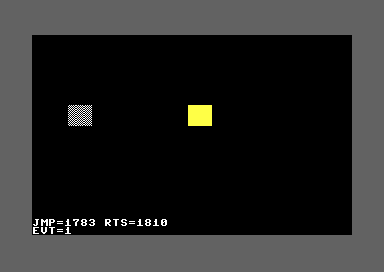

<!-- doc-type: recipe -->

# KickAssembler — Bytecode interpreter for animated scenes

## Synopsis

A minimal bytecode interpreter runs a script that moves two sprites with
position opcodes, waits 60 frames on a raster-IRQ counter, draws a
SID-voice-3 random pose, reads the joystick fire button, branches on the
result, and ends with an event code printed on screen. Dispatch is a
self-modified `JMP` through a word table. Before benchmarking, the display
is blanked (`$D011` bit 4 = 0) and a ~200 000-cycle delay lets the blank
take effect; this removes VIC-II bad-line cycle stealing and makes the CIA1
measurements deterministic. The JMP-table and RTS-trick dispatch totals
(128 iterations each) appear on screen row 23 as hex. The `scene_bytecode_interpreter`
technique in `techniques/logic.md` covers the full design.

## Source

```asm
// scene-bytecode-interpreter.asm
// KickAssembler
// A minimal bytecode interpreter for animated scenes.
// A raster IRQ at line 252 increments a frame counter. The interpreter
// runs a script: a 60-frame counted loop, sprite position opcodes for two
// sprites, a SID-voice-3 random pose, a joystick-fire read, a skip branch,
// and an end opcode returning an event code shown on screen.
// Dispatch: opcode*2 is added to the table base address and both bytes
// are stored into the JMP (abs) operand (self-modified). An RTS-trick
// dispatcher is benchmarked with CIA1 for comparison; the counter lives
// in zero page so the table-index X register is not confused with the
// iteration count. The display is blanked during both benchmarks so
// VIC-II badlines cannot steal cycles. Both totals (128 iterations) are
// shown on row 23 in hex.
//
// Build: java -jar KickAss.jar scene-bytecode-interpreter.asm \
//        -o scene-bytecode-interpreter.prg

BasicUpstart2(start)
.encoding "screencode_upper"

.const SCREEN  = $0400
.const COLRAM  = $D800
.const SPRPTR  = SCREEN + $3F8

// Zero page -- interpreter state
.const ZPC   = $FB
.const ZPCHI = $FC
.const ZFRAM = $FD
.const ZLOOP = $FE
.const ZJOY  = $FF
// Zero page -- scratch
.const ZWREF = $F8
.const ZEL_N = $F7
.const ZSK_N = $F6
.const ZBCNT = $F5     // bench iteration counter

// CIA1 timer A
.const C1TLO = $DC04
.const C1THI = $DC05
.const C1CRA = $DC0E

// SID voice 3
.const SV3FH  = $D40E
.const SV3FLO = $D40F
.const SV3CTL = $D412
.const SV3RND = $D41B

// VM opcodes
.const O_END    = 0
.const O_SPRX   = 1
.const O_SPRY   = 2
.const O_POKE   = 3
.const O_WAIT   = 4
.const O_LOOP   = 5
.const O_ENDLP  = 6
.const O_RNDP   = 7
.const O_JOYF   = 8
.const O_SKIPNZ = 9

.const ITERS = 128

// Screen codes (screencode_upper encoding)
.const SC_E  = $05
.const SC_J  = $0a
.const SC_M  = $0d
.const SC_P  = $10
.const SC_R  = $12
.const SC_S  = $13
.const SC_T  = $14
.const SC_V  = $16
.const SC_EQ = $3d

start:
    sei

    lda #$0b
    sta $d020
    lda #$00
    sta $d021
    lda #$1b
    sta $d011
    lda #$c8
    sta $d016

    // Clear screen
    lda #$20
    ldx #0
!:
    sta SCREEN+$000,x
    sta SCREEN+$100,x
    sta SCREEN+$200,x
    sta SCREEN+$300,x
    inx
    bne !-

    // Colour RAM: white
    lda #$01
    ldx #0
!:
    sta COLRAM+$000,x
    sta COLRAM+$100,x
    sta COLRAM+$200,x
    sta COLRAM+$300,x
    inx
    bne !-

    // Sprite shapes at $2000 and $2040 (VIC ptrs 128 and 129).
    // VIC bank 0 $1000-$1FFF is character ROM; use $2000-$3FFF (RAM).
    // Shape 128 ($2000): solid (all bits on).
    ldx #62
!:
    lda #$ff
    sta $2000,x
    dex
    bpl !-
    // Shape 129 ($2040): striped ($AA odd indices, $55 even).
    ldx #62
spr1_loop:
    txa
    and #$01
    beq spr1_ev
    lda #$aa
    jmp spr1_st
spr1_ev:
    lda #$55
spr1_st:
    sta $2040,x
    dex
    bpl spr1_loop

    // Sprite hardware setup
    lda #$03
    sta $d015
    lda #$00
    sta $d017
    sta $d01d
    sta $d01c
    lda #$01
    sta $d027
    lda #$07
    sta $d028
    lda #$60
    sta $d000     // sprite 0 initial X = 96
    lda #$80
    sta $d001     // sprite 0 initial Y = 128
    lda #$c8
    sta $d002     // sprite 1 initial X = 200
    lda #$80
    sta $d003     // sprite 1 initial Y = 128
    lda #$00
    sta $d010
    lda #$80      // pointer 128 = VIC addr $2000 (solid)
    sta SPRPTR+0
    sta SPRPTR+1

    // SID voice 3: noise oscillator (PRNG)
    lda #$00
    sta SV3FLO
    lda #$ff
    sta SV3FH
    lda #$00
    sta SV3CTL
    lda #$81       // noise ($80) + gate ($01)
    sta SV3CTL

    // CIA1: mask all interrupt sources
    lda #$7f
    sta $dc0d
    lda $dc0d      // clear any pending

    // ---- Benchmark A: JMP-dispatch, ITERS iterations ----
    // Blank display first (DEN=0 at $D011 bit 4) to eliminate bad lines.
    // DEN is sampled at raster line $30 (48); a ~200 000-cycle delay ensures
    // at least two full frames pass before the CIA timer starts.
    lda #$0b       // $1B with bit 4 cleared = DEN=0
    sta $d011
    // Fixed delay: two nested loops burning ~200 000 cycles
    ldx #200
!:
    ldy #200
!:
    dey
    bne !-
    dex
    bne !-

    lda #<bench_opseq
    sta ZPC
    lda #>bench_opseq
    sta ZPCHI
    lda #ITERS
    sta ZBCNT

    lda #$ff
    sta C1TLO
    sta C1THI
    lda #$11
    sta C1CRA      // force-load + start CIA1 timer A

bj_loop:
    ldy #$00
    lda (ZPC),y    // fetch opcode
    inc ZPC
    bne bj_no
    inc ZPCHI
bj_no:
    asl            // op * 2
    clc
    adc #<bench_tbl
    sta bjmp+1     // patch JMP operand low byte
    lda #>bench_tbl
    adc #0
    sta bjmp+2     // patch JMP operand high byte
bjmp:
    jmp ($0000)    // dispatch (both bytes patched above)
bench_nop_jmp:
    dec ZBCNT
    bne bj_loop

    lda #$00
    sta C1CRA      // stop timer
    sec
    lda #$ff
    sbc C1TLO
    sta time_jmp
    lda #$ff
    sbc C1THI
    sta time_jmp+1

    // ---- Benchmark B: RTS-trick, ITERS iterations ----
    // Display still blanked; reset bench PC
    lda #<bench_opseq
    sta ZPC
    lda #>bench_opseq
    sta ZPCHI
    lda #ITERS
    sta ZBCNT

    lda #$ff
    sta C1TLO
    sta C1THI
    lda #$11
    sta C1CRA

br_loop:
    ldy #$00
    lda (ZPC),y
    inc ZPC
    bne br_no
    inc ZPCHI
br_no:
    asl            // op * 2 = 0 (opcode always 0 in bench_opseq)
    tax            // X = table index (separate from counter in ZBCNT)
    lda rts_tbl_hi,x
    pha
    lda rts_tbl_lo,x
    pha
    rts            // RTS trick: jump to bench_nop_rts
bench_nop_rts:
    dec ZBCNT
    bne br_loop

    lda #$00
    sta C1CRA
    sec
    lda #$ff
    sbc C1TLO
    sta time_rts
    lda #$ff
    sbc C1THI
    sta time_rts+1

    // Restore display (DEN=1)
    lda #$1b
    sta $d011

    // ---- Display timing on row 23 ----
    // Layout: "JMP=XXYY RTS=XXYY" (hex16 each, space-separated)
    lda #SC_J
    sta SCREEN+23*40+0
    lda #SC_M
    sta SCREEN+23*40+1
    lda #SC_P
    sta SCREEN+23*40+2
    lda #SC_EQ
    sta SCREEN+23*40+3
    lda time_jmp+1
    jsr hex_byte
    sta SCREEN+23*40+4
    stx SCREEN+23*40+5
    lda time_jmp
    jsr hex_byte
    sta SCREEN+23*40+6
    stx SCREEN+23*40+7

    lda #$20
    sta SCREEN+23*40+8  // space
    lda #SC_R
    sta SCREEN+23*40+9
    lda #SC_T
    sta SCREEN+23*40+10
    lda #SC_S
    sta SCREEN+23*40+11
    lda #SC_EQ
    sta SCREEN+23*40+12
    lda time_rts+1
    jsr hex_byte
    sta SCREEN+23*40+13
    stx SCREEN+23*40+14
    lda time_rts
    jsr hex_byte
    sta SCREEN+23*40+15
    stx SCREEN+23*40+16

    // ---- Raster IRQ at line 252 ----
    lda #<irq
    sta $0314
    lda #>irq
    sta $0315
    lda #$01
    sta $d01a
    lda #$01
    sta $d019      // clear stale VIC interrupt flag
    lda #$fc
    sta $d012
    lda #$00
    sta ZFRAM
    cli

    // ---- Run the VM script ----
    lda #$00
    sta ZJOY
    sta ZLOOP
    lda #<script
    sta ZPC
    lda #>script
    sta ZPCHI
    jsr run_vm

    // Row 24: "EVT=N"
    pha
    lda #SC_E
    sta SCREEN+24*40+0
    lda #SC_V
    sta SCREEN+24*40+1
    lda #SC_T
    sta SCREEN+24*40+2
    lda #SC_EQ
    sta SCREEN+24*40+3
    pla
    clc
    adc #$30       // screen code: '1'=$31, '2'=$32
    sta SCREEN+24*40+4

halt:
    jmp halt

// ---- IRQ handler ----
irq:
    inc ZFRAM
    lda #$01
    sta $d019
    jmp $ea31

// ---- hex_byte: A=byte; returns A=hi-nibble screen code, X=lo-nibble ----
hchars:
    .text "0123456789ABCDEF"

hex_byte:
    pha
    lsr
    lsr
    lsr
    lsr
    tax
    lda hchars,x
    sta hbt
    pla
    and #$0f
    tax
    lda hchars,x
    tax
    lda hbt
    rts
hbt:
    .byte 0

// ---- run_vm: execute script at ZPC/ZPCHI; returns event code in A ----
run_vm:
next_op:
    ldy #$00
    lda (ZPC),y
    inc ZPC
    bne vno
    inc ZPCHI
vno:
    asl            // op * 2
    clc
    adc #<vm_tbl
    sta vmjmp+1
    lda #>vm_tbl
    adc #0
    sta vmjmp+2
vmjmp:
    jmp ($0000)

// ---- fetch_byte: read from ZPC/ZPCHI, advance; return in A ----
fetch_byte:
    ldy #$00
    lda (ZPC),y
    inc ZPC
    bne fno
    inc ZPCHI
fno:
    rts

// CIA1 timing scratch
time_jmp: .word 0
time_rts: .word 0

// Bench opcode sequence (all opcode 0)
bench_opseq:
    .fill ITERS, 0

// Bench JMP table (inline)
bench_tbl:
    .word bench_nop_jmp

// RTS-trick tables for bench
rts_tbl_lo:
    .byte <(bench_nop_rts-1)
rts_tbl_hi:
    .byte >(bench_nop_rts-1)

// VM handler table
vm_tbl:
    .word h_end
    .word h_sprx
    .word h_spry
    .word h_poke
    .word h_wait
    .word h_loop
    .word h_endlp
    .word h_rndp
    .word h_joyf
    .word h_skipnz

// ---- Handlers ----
h_end:
    jsr fetch_byte   // event code -> A
    rts

h_sprx:
    jsr fetch_byte   // sprite# -> A
    asl              // * 2 = register Y offset
    sta ZEL_N        // save offset (fetch_byte clobbers Y internally)
    jsr fetch_byte   // x value -> A
    ldy ZEL_N        // restore Y
    sta $d000,y      // D000 (sprite 0 X) or D002 (sprite 1 X)
    jmp next_op

h_spry:
    jsr fetch_byte
    asl
    sta ZEL_N
    jsr fetch_byte
    ldy ZEL_N
    sta $d001,y      // D001 (sprite 0 Y) or D003 (sprite 1 Y)
    jmp next_op

h_poke:
    jsr fetch_byte
    sta poke_ins+1
    jsr fetch_byte
    sta poke_ins+2
    jsr fetch_byte   // value -> A
poke_ins: sta $ffff        // self-modified target
    jmp next_op

h_wait:
    jsr fetch_byte
    tax              // N -> X
wt_outer:
    lda ZFRAM
    sta ZWREF
wt_spin:
    lda ZFRAM
    cmp ZWREF
    beq wt_spin      // spin until ZFRAM changes (one IRQ period)
    dex
    bne wt_outer
    jmp next_op

h_loop:
    jsr fetch_byte
    sta ZLOOP
    jmp next_op

h_endlp:
    jsr fetch_byte   // back offset -> A
    sta ZEL_N
    lda ZLOOP
    beq el_done
    dec ZLOOP
    sec
    lda ZPC
    sbc ZEL_N
    sta ZPC
    bcs el_skip
    dec ZPCHI
el_skip:
    jmp next_op
el_done:
    jmp next_op

h_rndp:
    jsr fetch_byte   // sprite# -> A
    tay              // Y = sprite#
    lda SV3RND       // SID voice 3 noise register
    and #$01
    clc
    adc #$80         // pointer 128 (solid) or 129 (striped)
    sta SPRPTR,y
    jmp next_op

h_joyf:
    lda $dc00
    and #$10         // bit 4 = fire, active low
    bne jf_open
    lda #$01
    sta ZJOY
    jmp next_op
jf_open:
    lda #$00
    sta ZJOY
    jmp next_op

h_skipnz:
    jsr fetch_byte   // skip count -> A
    sta ZSK_N
    lda ZJOY
    beq sk_no        // ZJOY == 0: fire not pressed, no skip
    clc
    lda ZPC
    adc ZSK_N
    sta ZPC
    bcc sk_done
    inc ZPCHI
sk_done:
    jmp next_op
sk_no:
    jmp next_op

// ---- Script ----
// Offsets: LOOP(0-1), WAIT(2-3), ENDLP(4-5), SPRX0(6-8), SPRY0(9-11),
//          SPRX1(12-14), SPRY1(15-17), RNDP(18-19), JOYF(20),
//          SKIPNZ(21-22), END,1(23-24), END,2(25-26).
// ENDLP back=4: after fetch ZPC=offset 6; PC-4 = offset 2 = WAIT.
script:
    .byte O_LOOP,   60       // ZLOOP = 60
    .byte O_WAIT,   1        // wait 1 frame (uses ZFRAM + IRQ)
    .byte O_ENDLP,  4        // loop if ZLOOP > 0; back 4 bytes to WAIT
    .byte O_SPRX,   0, 60    // sprite 0 X = 60
    .byte O_SPRY,   0, 120   // sprite 0 Y = 120
    .byte O_SPRX,   1, 180   // sprite 1 X = 180
    .byte O_SPRY,   1, 120   // sprite 1 Y = 120
    .byte O_RNDP,   0        // random pose (SID $D41B bit 0 -> pointer 128/129)
    .byte O_JOYF             // ZJOY = joystick 2 fire (0 in headless VICE)
    .byte O_SKIPNZ, 2        // if fire pressed: skip 2 bytes to O_END,2
    .byte O_END,    1        // event 1 (no fire = path taken in headless VICE)
    .byte O_END,    2        // event 2 (fire pressed; skip target)
```

## Build

```bash
java -jar KickAss.jar scene-bytecode-interpreter.asm -o scene-bytecode-interpreter.prg
```

## Expected output

Dark grey (`$0B`) border, black background. The display is blanked during
the CIA1 benchmarks, then restored. After 60 frames the script moves two
sprites and ends with event code 1 (no joystick fire in headless VICE).

- **Row 23**: white text `JMP=1783 RTS=1810` (PAL, CIA1 cycles for 128
  iterations, display blanked; 47.0 cyc/iter JMP, 48.1 RTS). NTSC shows
  `JMP=1814 RTS=1784` (48.1 and 47.0). Values may differ from the page
  here if the benchmark code is at different addresses.
- **Sprite 0** (white, striped — SID noise chose pointer 129): at VIC X=60,
  VIC Y=120. On PAL, screen pixels x=68–91, y=105–125.
- **Sprite 1** (yellow, solid — pointer 128): at VIC X=180, VIC Y=120.
  On PAL, screen pixels x=188–211, y=105–125.
- **Row 24**: white text `EVT=1`.

On NTSC, sprites at the same VIC coordinates, screenshot rows shifted up
by 12 (screenshot row = raster line − 28 vs − 16 on PAL).

PIL verification (PAL):

```python
from PIL import Image
im = Image.open('out.png').convert('RGB')
px = im.load()
w, h = im.size
assert (w, h) == (384, 272), f"Wrong size: {w}x{h}"
# Sprite 0 (white, striped) at VIC X=60, Y=120 -> screen x=68, y=105
assert px[68, 105] == (255, 255, 255), f"Sprite 0 not visible at (68,105): {px[68,105]}"
# Sprite 1 (yellow) at VIC X=180, Y=120 -> screen x=188, y=105
r, g, b = px[188, 105]
assert r > 200 and g > 200 and b < 150, f"Sprite 1 not yellow at (188,105): {px[188,105]}"
# Row 23 timing: display y=219-226; check for any white pixel
assert any(px[x, 219] == (255, 255, 255) for x in range(32, 200)), "No timing text on row 23"
# Row 24 EVT=1: check 'E' pixel present
assert any(px[32+dx, 228] not in [(0,0,0),(98,98,98)] for dx in range(8)), "EVT text missing"
print("PASS")
```



## Why this works

**Dispatch.** The interpreter fetches one opcode byte per pass: `LDA (ZPC),Y`
with Y=0 reads from the script, then `INC ZPC` (with carry into `ZPCHI`)
advances the PC. `ASL` doubles the opcode to a byte table offset. Two
stores patch both bytes of a `JMP (abs)` operand; the handler address is
read from the inline word table `vm_tbl` and jumped to. Each handler ends
with `JMP next_op` to loop.

The Pirates! (1987) method patches only the low byte because its table is
page-aligned (high byte fixed at `$A3`). Dispatch costs: (a) is exclusive
of handler body; (b) includes the benchmark NOP handler (`DEC zp + BNE` =
8 cycles). All figures rung 3 unless marked.

| Method | (a) fetch + dispatch | (b) full iteration measured (rung 1, PAL, CIA1, display blanked) |
|---|---|---|
| Pirates! 1-byte-patch JMP | 15 + 11 = 26 cycles | — |
| This recipe 2-byte-patch JMP | 15 + 23 = 38 cycles | 47 cycles ($1783 / 128; 8-cycle NOP handler included) |
| RTS trick | 15 + 24 = 39 cycles | 48 cycles ($1810 / 128) |

**Blanking during benchmarks.** `$D011` bit 4 (DEN) suppresses the display
for the full frame when cleared before raster line 48 (`$30`). Two
~100 000-cycle loops give about two full frames for the blank to take
effect. Without blanking, VIC-II bad lines (each stealing ~43 cycles once
per 8 raster lines through the display region) add up to ~390 extra cycles
per frame and vary in count depending on where the benchmark falls in the
raster. With DEN=0, there are no bad lines, and the CIA1 count is fixed.

**Frame counter.** The raster IRQ at line 252 increments `ZFRAM`. The
`h_wait` handler spins on `ZFRAM` so each "wait 1 frame" is exactly one
IRQ period. The script waits 60 frames by running the WAIT opcode 60 times
inside a counted loop. Pirates! does not use the frame counter; it times
scenes by pass counts, which are not frame-locked (study rung 1).

**Fetch-byte clobbers Y.** `fetch_byte` sets `LDY #0` internally. Handlers
that need the sprite register offset (Y = sprite# × 2) between two
`fetch_byte` calls save it to zero page (`ZEL_N`) before the second call
and restore it with `LDY ZEL_N` before the `STA $D000,Y`.

**RTS trick counter.** The RTS trick benchmark uses `TAX` to load the table
index (always 0 for opcode 0). If X held the iteration counter, `TAX` would
overwrite it. The counter lives in zero-page `ZBCNT` and the handler
decrements it with `DEC ZBCNT` instead of `DEX`. The JMP benchmark does the
same for symmetry.

**Sprite shapes.** VIC bank 0 maps `$1000–$1FFF` to the character ROM for
VIC reads, though CPU writes go to RAM there. Both sprite shapes are placed
at `$2000` and `$2040` (bank 0 RAM) with pointers 128 and 129. Shape 128
is solid (`$FF` bytes); shape 129 is striped (`$AA`/`$55`). The SID noise
registers are seeded deterministically by the harness, so the RNDP opcode
consistently chooses pointer 129 (striped) for sprite 0 in both PAL and
NTSC runs.
