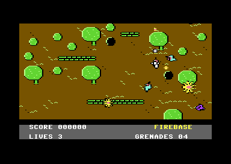

# run-and-gun (FIREBASE)

A vertical run-and-gun for the stock C64, PAL and NTSC, built to be copied
and grown into a game. This is its first slice: the soldier walks up the
jungle and the map follows him, and he shoots and throws grenades. There
are no enemies or sounds yet; their modules are stubs with fixed interfaces
(`PLAN.md`, "Modules").

- The map scrolls only while the soldier pushes up past the middle of the
  screen, one line a frame, and never back (`threshold_scroll_v`). It stops
  at the map's top, the fort's gate.
- Every eighth line the playfield is redrawn whole from a raw 40-column map
  (`row_map_redraw`); colour RAM is one value and never moves.
- A black band from the invalid ECM+BMM mode sits between the playfield and
  a three-row panel: SCORE, LIVES, GRENADES (`invalid_mode_band`).
- Sixteen sprite slots go through a sorted multiplexer; free slots are
  parked, never tested (`sprite_multiplex_game`, `sprite_slot_parking`).
- The soldier walks eight ways at one pixel a frame; his facing turns one
  step a frame toward the stick (`facing_turn_step`). Trees, rocks and
  sandbags stop him and canopies cover him, from one attribute byte per
  character code (`char_attribute_flags`).
- Fire shoots once per press along his facing, up to three shots, each
  stopped by trees, rocks and sandbags. SPACE or port-1 fire throws a
  grenade straight up the map: it lands 60 pixels ahead and bursts for 16
  frames. Five grenades; the panel counts them down (`grenade_lob`).

Fire starts the game on the title. Make a project from it in c64-kb with
`npm run new-project -- run-and-gun <dir>`, then `make run` (joystick in
port 2).

## Files

| File | What it holds |
|---|---|
| `src/game.h` | the memory map, the kernel's variables, the slot layout, the coordinate rules, the shared state |
| `src/main.c` | the blob and the assets placed, states, the frame loop, the redraw pair, the autopilot, the meter, the verdict |
| `src/scroll.c/h` | the view (`scroll_top`, `scroll_ys`, `scroll_wy`), `scroll_step`, map coordinates, `attr_at` |
| `src/soldier.c/h` | the player: stick, facing, movement, blocking, priority, slot 0 |
| `src/objects.c/h` | `slot_show`, `slot_park`, the object pool (enemies go here) |
| `src/weapons.c/h` | the gun and the grenade (slots 1-4), and the hit boxes (`Box`, `box_hit`, `box_has`) the collision module will use |
| `src/weapons_test.h` | `make weapons`: the scripted play and its verdict |
| `src/collide.c/h`, `src/flow.c/h` | stubs for the next modules, each with its contract in the header |
| `src/display.c/h` | VIC bank, the ROM letters into the character set, colour RAM, text, the panel |
| `src/kernel.asm` | the raster chain: frame IRQ (line 250), the band (line 211), the redraw |
| `src/mux.asm` | the 16-slot multiplexer: sort, build, zones, late guard, `$D01B` per slot |
| `src/sound.asm` | audio hooks, stubs: `audio_init`, `audio_play`, `sfx_request` |
| `src/gen/` | generated by `tools/mkassets.py`, committed: charset, attributes, map, sprites, `assets.h` |
| `tools/mkassets.py` | draws the jungle glyphs, the map and the soldier; `--preview DIR` writes PNGs |
| `tools/mkweapons.py` | draws the bullet, the grenade and the blast (src/gen/weapon_sprites.*) |
| `tools/phases.py` | `make phases`: the band and panel at every YSCROLL phase |
| `expect.json`, `expect-mapend.json`, `expect-weapons.json` | what `make check`, `make mapend` and `make weapons` grade in the screenshots |
| `PLAN.md` | the plan from the KB's tools, the measured budget, the memory map, the modules |
| `KB-GAPS.md` | where the KB was wrong, missing or misleading while this was built |

## How a frame runs

1. Line 250, frame IRQ: apply the last commit (YSCROLL and the sprite
   table together), write the playfield's `$D011`, `$D016`, `$D021` and the
   first eight sprites, call `audio_play`, set `frame_flag`.
2. The main loop wakes: soldier, objects, weapons, collisions, flow; then
   every slot, `mux_sort`, `mux_build` and one commit store.
3. Zone IRQs reuse the eight sprites down the screen.
4. Line 211, band IRQ: ECM+BMM on at line 213's end, YSCROLL 7 on 215, text
   back at 222's end; the panel's colours inside the band; `band_tick`.
5. If YSCROLL wrapped this frame, the loop waits for `band_tick` and
   redraws 21 rows; the next frame starts late and runs no logic.

## Measured

VICE x64sc 3.10, `make shot check` (details and limits in `PLAN.md`,
"Budget"):

| | PAL | NTSC |
|---|---|---|
| Logic frame, worst / typical (cycles, IRQs included) | 3,049 / 2,971 | 3,071 / 2,994 |
| Redraw (cycles, IRQs inside included) | 14,100 | 14,317 |
| Redraw's smallest lead over the beam | 73 lines | 27 lines |
| Lost frames | 0 | 0 |

## Extending it

- **Enemies.** Fill `objects.c`: a spawn list sorted by map row, fired in
  `objects_rows(top)` when the view's top row reaches it (`wave_director`);
  each enemy in map coordinates, drawn with `slot_show` at
  `Y = my - scroll_wy + 54`. Keep them above sprite Y 187.
- **Collisions.** Fill `collide.c` with the boxes `weapons.h` gives:
  `weapons_bullet_box(i, &b)`, `weapons_bullet_spent(i)` on a hit, and
  `weapons_blast_box(&b)` every blast frame (`PLAN.md`, "Weapons").
- **Flow.** Death and `checkpoint_respawn` restart through
  `scroll_init(row, 0)`; `area_end_gate_wave` begins when
  `scroll_can_step()` is 0; the gate is `G_GATE`, map rows 1-2.
- **Audio.** Replace `sound.asm`'s bodies (`sfx_voice_takeover`). Its
  line-250 cost comes off the redraw's NTSC lead: re-read row 6 of the
  verdict.
- **Art.** Change `tools/mkassets.py`, run `make assets`, commit `src/gen/`.

## Checks

- `make shot check`: the autopilot walks up, is stopped by the sandbags,
  goes round them and up under a canopy; it grades itself (green border)
  and `expect.json` grades the screenshots on PAL and NTSC. `make check`
  also runs `make phases`.
- `make selftest`: the FORCE_FAULT build (8 pixels right, stopped by a
  trunk) must fail.
- `make mapend`: the view stops at the map's top and he walks on through
  the gate.
- `make weapons`: a scripted run fires, turns, throws five grenades and
  shoots while scrolling; it grades itself and `expect-weapons.json` grades
  the screenshots on PAL and NTSC. `make weaponsfault` (autofire) must fail.
- `make assetcheck`: `src/gen/` is what the tool writes.
