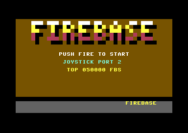

# run-and-gun (FIREBASE)

A vertical run-and-gun for the stock C64, PAL and NTSC, built to be copied
and grown into a game. The soldier walks up the jungle and the map follows
him; riflemen, runners and grenadiers come from the map rows ahead; he
shoots and throws grenades; a SID tune plays under the effects; a title,
an attract demo, game over, name entry and a high-score table frame it.
Nothing collides yet: the collision module, checkpoints and the area-end
gate are the next modules, with fixed interfaces (`PLAN.md`, "Modules").

- The map scrolls only while the soldier pushes up past the middle of the
  screen, one line a frame, and never back (`threshold_scroll_v`). It stops
  at the map's top, the fort's gate.
- Every eighth line the playfield is redrawn whole from a raw 40-column map
  (`row_map_redraw`); colour RAM is one value and never moves.
- A black band from the invalid ECM+BMM mode sits between the playfield and
  a three-row panel: SCORE, LIVES, GRENADES (`invalid_mode_band`).
- Sixteen sprite slots go through a sorted multiplexer; free slots are
  parked, never tested (`sprite_multiplex_game`, `sprite_slot_parking`).
- The soldier walks eight ways at one pixel a frame; his facing turns one
  step a frame toward the stick (`facing_turn_step`). Trees, rocks and
  sandbags stop him and canopies cover him, from one attribute byte per
  character code (`char_attribute_flags`).
- Fire shoots once per press along his facing, up to three shots, each
  stopped by trees, rocks and sandbags. SPACE or port-1 fire throws a
  grenade straight up the map: it lands 60 pixels ahead and bursts for 16
  frames. Five grenades; the panel counts them down (`grenade_lob`).
- Enemies come from a spawn list keyed to map rows, fired as the view's top
  row reaches each (`wave_director`, `object_pool`): riflemen aim eight
  ways, runners cross, grenadiers lob. Their shots end on walls.
- A three-voice tune, "Firebase March", with five effects that take voices
  1 and 2 while the melody keeps voice 3 (`sfx_voice_takeover`).
- The front end: title with logo, a table of five high scores, an attract
  demo from a recorded stick, game over and joystick name entry
  (`game_state_machine`, `front_end_and_attract`, `high_score_table_insert`).

Fire starts the game on the title. Make a project from it in c64-kb with
`npm run new-project -- run-and-gun <dir>`, then `make run` (joystick in
port 2).

## Files

| File | What it holds |
|---|---|
| `src/game.h` | the memory map, the kernel's variables, the slot layout, the coordinate rules, the shared state |
| `src/main.c` | the blob and the assets placed, states, the frame loop, the redraw pair, the autopilot, the meter, the verdicts of every test build |
| `src/scroll.c/h` | the view (`scroll_top`, `scroll_ys`, `scroll_wy`), `scroll_step`, map coordinates, `attr_at` |
| `src/soldier.c/h` | the player: stick, facing, movement, blocking, priority, slot 0 |
| `src/objects.c/h`, `src/spawns.h` | `slot_show`, `slot_park`, the pool, the spawn list, the three enemy kinds, their shots and grenades (slots 5-15) |
| `src/weapons.c/h` | the gun and the grenade (slots 1-4), and the hit boxes (`Box`, `box_hit`, `box_has`) the collision module will use |
| `src/weapons_test.h` | `make weapons`: the scripted play and its verdict |
| `src/collide.c/h` | the stub for the next module, with its contract in the header |
| `src/flow.c/h` | score (three BCD bytes), lives, grenades, how a game ends |
| `src/front.c/h`, `src/hiscore.c/h` | title, table, attract demo, game over, name entry; the high-score table |
| `src/display.c/h` | VIC bank, the ROM letters into the character set, colour RAM, text, the panel |
| `src/kernel.asm` | the raster chain: frame IRQ (line 250), the band (line 211), the redraw |
| `src/mux.asm` | the 16-slot multiplexer: sort, build, zones, late guard, `$D01B` per slot |
| `src/sound.asm`, `src/sound.c/h` | the SID driver (tune and effects, held off the redraw) and `sfx()` |
| `src/gen/` | generated, committed: charset, attributes, map, sprites, logo (`mkassets.py`), weapon sprites (`mkweapons.py`), the tune (`mktune.py`) |
| `tools/mkassets.py`, `mkweapons.py`, `mktune.py` | the art, the map and the tune; `make assets` runs all three, `make assetcheck` compares |
| `tools/phases.py`, `sidtrace.py`, `longplay.py`, `gallery.py` | `make phases`, `make audio`, `make longplay`, `make gallery` |
| `expect*.json` | what each check target grades in its screenshots |
| `PLAN.md` | the plan from the KB's tools, the measured budget, the memory map, the modules |
| `KB-GAPS.md` | where the KB was wrong, missing or misleading while this was built |

## How a frame runs

1. Line 250, frame IRQ: apply the last commit (YSCROLL and the sprite
   table together), write the playfield's `$D011`, `$D016`, `$D021` and the
   first eight sprites, play one step of the tune, set `frame_flag`.
2. The main loop wakes: soldier, objects, weapons, collisions, flow; then
   every slot, `mux_sort`, `mux_build` and one commit store.
3. Zone IRQs reuse the eight sprites down the screen.
4. Line 211, band IRQ: ECM+BMM on at line 213's end, YSCROLL 7 on 215, text
   back at 222's end; the panel's colours inside the band.
5. The redraw pair. On the frame YSCROLL wraps, only the soldier and the
   spawns run, then 21 rows are copied from line 64 (a row may be rewritten
   once the beam has fetched it). The frame after runs the weapons,
   collisions and rules. No enemy thinks on either frame.

## Measured

VICE x64sc 3.10 (details, the before and after, and limits in `PLAN.md`,
"Combined budget"):

| | PAL | NTSC |
|---|---|---|
| Logic frame, worst / typical (cycles, IRQs included, `make weapons`) | 9,714 / 6,434 | 10,280 / 6,796 |
| Redraw, most cycles (`make weapons`) | 16,106 | 16,063 |
| Redraw's smallest lead over the beam (`make weapons`, `make longplay`) | 195 / 211 lines | 159 / 168 lines |
| The frame after a redraw ends by line (limit 250) | 135 | 197 |
| Lost frames (`make weapons`, `make longplay`) | 0 | 0 |

## Extending it

- **Collisions.** Fill `collide.c` with the boxes `weapons.h` and
  `objects.h` give: `weapons_bullet_box(i, &b)` and `weapons_bullet_spent(i)`,
  `weapons_blast_box(&b)`, `kind_box`, `kind_flags` and `obj_kill(slot)`;
  score with `flow_add_score(bcd)`, and call `flow_player_died` on a hit
  (`PLAN.md`, "Weapons" and "Enemies").
- **Flow.** `checkpoint_respawn` restarts through `scroll_init(row, 0)`,
  `objects_reset` and `objects_rows`; `area_end_gate_wave` begins when
  `scroll_can_step()` is 0; the gate is `G_GATE`, map rows 1-2; its end
  calls `flow_area_cleared`.
- **Sound.** Call `sfx(SFX_...)` (sound.h) where the game does something;
  the tune is `tools/mktune.py`.
- **The budget.** Work added to the redraw frame delays the copy; work
  added to the frame after must end before line 250. Re-read verdict rows
  6 and 8 and run `make longplay` after either.
- **Art.** Change the tools, run `make assets`, commit `src/gen/`.

## Checks

- `make shot check`: the autopilot walks up among the enemies, is stopped by
  the sandbags, goes round them and up under a canopy; it grades itself
  (green border) and `expect.json` grades the screenshots on PAL and NTSC.
  `make check` also runs `make phases` and `make audio`.
- `make selftest`: the FORCE_FAULT build (8 pixels right, stopped by a
  trunk) must fail; so must the audio fault builds.
- `make mapend`: the view stops at the map's top and he walks on through
  the gate.
- `make enemies`: the spawn list, the three kinds, their fire, parked
  slots; its ENEMY_FAULT build must fail.
- `make weapons`: a scripted run fires, turns, throws five grenades and
  shoots while scrolling among the enemies; `make weaponsfault` (autofire)
  must fail.
- `make frontend` and `make fedrive`: title, play, game over, name entry,
  table and title, scripted and then on the real `$DC00`.
- `make longplay`: the normal build driven 2,700 frames on each model: no
  lost frame, no late redraw, the lead at least 8 lines.
- `make assetcheck`: `src/gen/` is what the tools write.
- `make gallery` and `make title`: the two pictures above.
