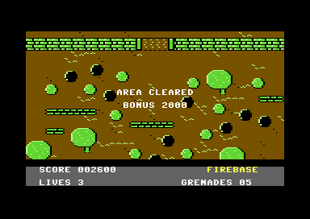

# run-and-gun (FIREBASE)

A vertical run-and-gun for the stock C64, PAL and NTSC, built to be copied
and grown into a game. The soldier walks up the jungle and the map follows
him; riflemen, runners and grenadiers come from the map rows ahead; he
shoots and throws grenades, and they shoot back; a death sends him back to
a checkpoint; at the map's top a counted wave comes out of the fort, and
when it is dead he walks into the gate and the next area begins. A SID tune
plays under the effects; a title, an attract demo, game over, name entry
and a high-score table frame it.

- The map scrolls only while the soldier pushes up past the middle of the
  screen, one line a frame, and never back (`threshold_scroll_v`). It stops
  at the map's top, the fort's gate.
- Every eighth line the playfield is redrawn whole from a raw 40-column map
  (`row_map_redraw`); colour RAM is one value and never moves.
- A black band from the invalid ECM+BMM mode sits between the playfield and
  a three-row panel: SCORE, LIVES, GRENADES (`invalid_mode_band`).
- Sixteen sprite slots go through a sorted multiplexer; free slots are
  parked, never tested (`sprite_multiplex_game`, `sprite_slot_parking`).
- The soldier walks eight ways at one pixel a frame; his facing turns one
  step a frame toward the stick (`facing_turn_step`). Trees, rocks and
  sandbags stop him and canopies cover him, from one attribute byte per
  character code (`char_attribute_flags`).
- Fire shoots once per press along his facing, up to three shots, each
  stopped by trees, rocks and sandbags. SPACE or port-1 fire throws a
  grenade straight up the map: it lands 60 pixels ahead and bursts for 16
  frames. Five grenades; the panel counts them down (`grenade_lob`).
- Enemies come from a spawn list keyed to map rows, fired as the view's top
  row reaches each (`wave_director`, `object_pool`): riflemen aim eight
  ways, runners cross, grenadiers lob. Their shots end on walls.
- Collisions: his shots kill enemies (rifleman 100, runner 150, grenadier
  200) and his grenade's blast kills everything in its box; enemies, their
  shots and their blasts kill him, and so does the swamp (the character
  set's deadly bit). One box per kind, half the pool tested a frame
  (`per_frame_hitbox`, `grenade_lob`, `char_attribute_flags`).
- A death plays for 64 frames and takes a life; he restarts at the nearest
  checkpoint row behind the view, with the enemies re-spawned from the list
  and his grenades topped up to five. No lives left: game over
  (`checkpoint_respawn`).
- At the map's top the scroll stops and a counted wave of soldiers comes
  out of the fort, from a seeded generator. When all are out and dead the
  stick is taken, he walks into the gate, 2,000 points, AREA CLEARED, and
  the next area: the same map in other colours, the enemies firing twice
  as often (`area_end_gate_wave`).
- A three-voice tune, "Firebase March", with five effects that take voices
  1 and 2 while the melody keeps voice 3 (`sfx_voice_takeover`).
- The front end: title with logo, a table of five high scores, an attract
  demo from a recorded stick, game over and joystick name entry
  (`game_state_machine`, `front_end_and_attract`, `high_score_table_insert`).

Fire starts the game on the title. Make a project from it in c64-kb with
`npm run new-project -- run-and-gun <dir>`, then `make run` (joystick in
port 2).

## Files

| File | What it holds |
|---|---|
| `src/game.h` | the memory map, the kernel's variables, the slot layout, the coordinate rules, the shared state |
| `src/main.c` | the blob and the assets placed, states, the frame loop, the redraw pair, the autopilot, the meter, the verdicts of every test build |
| `src/scroll.c/h` | the view (`scroll_top`, `scroll_ys`, `scroll_wy`), `scroll_step`, map coordinates, `attr_at` |
| `src/soldier.c/h` | the player: stick, facing, movement, blocking, priority, slot 0 |
| `src/objects.c/h`, `src/spawns.h` | `slot_show`, `slot_park`, the pool, the spawn list, the three enemy kinds, their shots and grenades (slots 5-15) |
| `src/weapons.c/h` | the gun and the grenade (slots 1-4), and the hit boxes (`Box`, `box_hit`, `box_has`) |
| `src/collide.c/h` | who hit whom: bullets and the blast against enemies, enemies and the swamp against the soldier |
| `src/flow.c/h` | score (three BCD bytes), lives, grenades, the death, the checkpoint restart, how a game ends |
| `src/area.c/h` | the area counter and colours, the gate wave, the walk into the gate, the beat, the next area |
| `src/weapons_test.h`, `collide_test.h`, `death_test.h`, `area_test.h` | the scripted plays and verdicts of `make weapons`, `collide`, `death`, `area` and `fullpool` |
| `src/front.c/h`, `src/hiscore.c/h` | title, table, attract demo, game over, name entry; the high-score table |
| `src/display.c/h` | VIC bank, the ROM letters into the character set, colour RAM, text, the panel |
| `src/kernel.asm` | the raster chain: frame IRQ (line 250), the band (line 211), the redraw |
| `src/mux.asm` | the 16-slot multiplexer: sort, build, zones, late guard, `$D01B` per slot |
| `src/sound.asm`, `src/sound.c/h` | the SID driver (tune and effects, held off the redraw) and `sfx()` |
| `src/gen/` | generated, committed: charset, attributes, map, sprites, logo (`mkassets.py`), weapon sprites (`mkweapons.py`), the tune (`mktune.py`) |
| `tools/mkassets.py`, `mkweapons.py`, `mktune.py` | the art, the map and the tune; `make assets` runs all three, `make assetcheck` compares |
| `tools/phases.py`, `sidtrace.py`, `longplay.py`, `gallery.py` | `make phases`, `make audio`, `make longplay`, `make gallery` |
| `tools/mkassets.py` `CHECKPOINTS`, `SWAMP` | the checkpoint rows and the swamp, level data written to `src/gen/assets.h` and the map |
| `expect*.json` | what each check target grades in its screenshots |
| `PLAN.md` | the plan from the KB's tools, the measured budget, the memory map, the modules |
| `KB-GAPS.md` | where the KB was wrong, missing or misleading while this was built |

## How a frame runs

1. Line 250, frame IRQ: apply the last commit (YSCROLL and the sprite
   table together), write the playfield's `$D011`, `$D016`, `$D021`-`$D023`
   (the area's colours) and the first eight sprites, play one step of the
   tune, set `frame_flag`.
2. The main loop wakes: soldier, objects, the area, weapons, collisions,
   flow; then every slot, `mux_sort`, `mux_build` and one commit store.
   The objects and the collisions each skip work past a line (95, 100) and
   do it next frame, so a crowded frame is not lost.
3. Zone IRQs reuse the eight sprites down the screen.
4. Line 211, band IRQ: ECM+BMM on at line 213's end, YSCROLL 7 on 215, text
   back at 222's end; the panel's colours inside the band.
5. The redraw pair. On the frame YSCROLL wraps, only the soldier and the
   spawns run, then 21 rows are copied from line 64 (a row may be rewritten
   once the beam has fetched it). The frame after runs the weapons,
   collisions and rules. No enemy thinks on either frame.
6. A restart (after a death, or into the next area) is a redraw frame of
   its own: the new view, the cleared pool and the soldier at his start are
   committed with YSCROLL 0 and copied from line 64; nothing is blanked.

## Measured

VICE x64sc 3.10 (details, the before and after, and limits in `PLAN.md`,
"Combined budget" and "Collisions"):

| | PAL | NTSC |
|---|---|---|
| Logic frame, worst / typical (cycles, IRQs included, `make weapons`) | 11,722 / 7,192 | 11,198 / 7,696 |
| Logic frame, worst / typical, the pool full (`make fullpool`) | 13,691 / 11,517 | 13,568 / 11,945 |
| collide(), one pass at the `make collide` freeze / average a frame (profiler) | 465 | 465 / 660-750 |
| Redraw's smallest lead over the beam (`make weapons`, `make longplay`) | 200 / 226 lines | 159 / 178 lines |
| The frame after a redraw ends by line (limit 250, `make weapons`) | 170 | 240 |
| A restart's logic, then its redraw's lead (`make death`) | 1,480, 231 lines | 1,480, 189 lines |
| Lost frames (every proof, `make longplay`) | 0 | 0 |

## Extending it

- **Enemies and scores.** A new kind needs its box and flags in
  `objects.c` (`kind_box`, `kind_flags`) and its points in collide.c
  (`kill_tens`); collide() finds it.
- **Levels.** Checkpoint rows and the swamp are in tools/mkassets.py
  (`CHECKPOINTS`, `SWAMP`; it asserts each restart pad is clear); a new
  hazard is a glyph with `A_DEADLY`. The next area's colours and fire rate
  are area.c's tables and objects.c `place`.
- **The area end.** `WAVE_BASE`, `WAVE_MASK`, `GATE_X`/`GATE_Y`,
  `AREA_BONUS` and `BEAT_FRAMES` are in area.h.
- **Sound.** Call `sfx(SFX_...)` (sound.h) where the game does something;
  the tune is `tools/mktune.py`.
- **The budget.** Work added to the redraw frame delays the copy; work
  added to the frame after must end before line 250, and on NTSC in a busy
  scene that frame already ends by line 240. Give new per-frame work a
  deadline like objects.c `OBJ_LATE` or collide.c `COLLIDE_LATE`, re-read
  verdict rows 6 and 8, and run `make longplay` and `make fullpool`.
- **Aging an object.** `make blasts` proves every enemy grenade blast is
  freed by age 20. Keep objects.c's expiry test branching inside its case:
  the `gone = a >= 20` form is dropped by Oscar64 -O2 (c64-kb
  `docs/toolchains/oscar64-reference.md`, "A case's expiry compare is
  dropped..."; issue #133).
- **Art.** Change the tools, run `make assets`, commit `src/gen/`.

## Checks

- `make shot check`: the autopilot walks up among the enemies, is stopped by
  the sandbags, goes round them and up under a canopy; it grades itself
  (green border) and `expect.json` grades the screenshots on PAL and NTSC.
  `make check` also runs `make phases` and `make audio`.
- `make selftest`: the FORCE_FAULT build (8 pixels right, stopped by a
  trunk) must fail; so must the audio fault builds.
- `make mapend`: the view stops at the map's top and he walks on through
  the gate.
- `make enemies`: the spawn list, the three kinds, their fire, parked
  slots; its ENEMY_FAULT build must fail.
- `make blasts`: enemy grenade blasts by blocking terrain with the pool
  full expire at age 20 (issue #133); its BLAST_FAULT build must fail.
- `make weapons`: a scripted run fires, turns, throws five grenades and
  shoots while scrolling among the enemies; `make weaponsfault` (autofire)
  must fail.
- `make frontend` and `make fedrive`: title, play, game over, name entry,
  table and title, scripted and then on the real `$DC00`.
- `make collide`: kills by bullet and blast, the score per kind, a death by
  an enemy, the restart with the window re-spawned and grenades topped up.
- `make death`: three deaths on the swamp, restarts at checkpoint 40,
  grenades 3 and 4 back to 5, a life each, game over.
- `make area`: the gate wave counted out and shot, the walk into the gate,
  the bonus, the beat (shot mid-run) and area 1 in its colours.
- `make fullpool`: area 3's wave fills all 11 pool slots under fire: no
  lost frame on either model.
- `make longplay`: the normal game (99 lives) driven 2,700 frames on each
  model: no lost frame, no late redraw, the lead at least 8 lines.
- `make assetcheck`: `src/gen/` is what the tools write.
- `make gallery`, `make cleared` and `make title`: the three pictures above.
